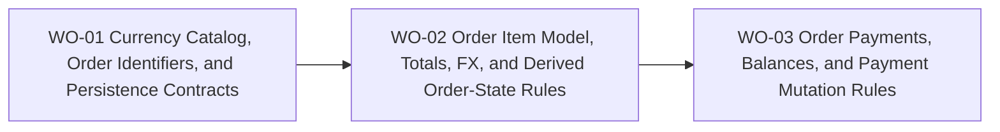

# BP-01 Order Domain Foundation

## Purpose

Define the persistence, state, and monetary contracts that make order and payment behavior coherent before any list or detail experience is layered on top.

## Runtime Components

- Prisma models for orders, order items, payments, private notes, history entries, and currencies
- order query modules and mutation modules under the private app data layer
- validation schemas for create, edit, pay, delete, and cancel flows
- shared money and identifier helpers in `src/lib`
- detail-view data loaders that join store, item, payment, and derived summary information

## Architecture Decisions

- Currency is not stored in a dedicated database table. The permitted currency set is the hardcoded allowlist `ALLOWED_COLLECTOR_BASE_CURRENCY_CODES` defined in `src/lib/catalog/collectorCountries.ts`, reusing the same catalog and Zod validator already in use by user settings. Localized currency names are resolved in the UI from the existing `currencies.{code}` i18n keys.
- Exchange-rate context should be stored once per order in MVP so reporting and derived totals have one stable conversion basis.
- Order status is derived, not directly editable, and exposes six states: `OPEN`, `PARTIALLY_IN_TRANSIT`, `IN_TRANSIT`, `PARTIALLY_DELIVERED`, `COMPLETED`, and `CANCELLED`. The pure function `deriveOrderStatus` (defined in WO-02) owns the derivation algorithm. Delivery mutations in [`FRD-08`](../../frd-08-delivery-management/frd-08-delivery-management.md) are responsible for calling it and persisting the result.
- Order identifiers should be generated at persistence time using a deterministic date-based prefix plus a two-digit daily sequence.
- Payment progress should be derived from payment records instead of duplicated into manually edited columns.
- Order history should be append-oriented and human-readable. **As implemented (2026-04-24):** the app does not expose per-entry user deletion of history rows on the order detail view (`deleteOrderHistoryEntry` removed); history remains a read-only audit trail in the UI. See [`FRD-05`](../frd-05-order-payment-shipment.md) `FR-05-22` / `BR-05-09` and [`BP-02 · WO-05`](../bp-02-order-workspace-and-list-experience/work-orders/wo-05-order-detail-view-private-note-payments-panel-and-action-menu.md).
- Delete and cancel must remain separate operations, but share one eligibility rule:
  - both are blocked when any item is linked to a non-cancelled delivery; the collector must first unlink the item from its delivery to unblock the operation
  - cancel preserves the order record, moves it to `CANCELLED`, and removes the order's payment records so balance reporting stays coherent
  - delete physically removes the order and its payment records; there is no delivery cascade because the eligibility rule prevents deletion while live delivery links exist

## Contracts

- currency contract:
  - input: currency code validated against `ALLOWED_COLLECTOR_BASE_CURRENCY_CODES`
  - output: selectable currency option with i18n-resolved label from `currencies.{code}`
- order create contract:
  - input: store, order date, expected delivery range, currency, optional exchange rate, total cost, item rows
  - output: persisted order with generated identifier and initial status `OPEN`
- order state contract:
  - input: item delivery associations (`ItemDeliveryState` per order item)
  - output: derived `OrderStatus` via pure `deriveOrderStatus` function — six states: `OPEN`, `PARTIALLY_IN_TRANSIT`, `IN_TRANSIT`, `PARTIALLY_DELIVERED`, `COMPLETED`, `CANCELLED`; full algorithm in `work-orders/wo-02-order-item-model-totals-fx-and-derived-order-state-rules.md`
- payment contract:
  - input: order id, payment amount, payment date
  - output: persisted payment row plus recalculated order payment summary (`paidAmount`, `remainingAmount`, `paymentPercentage`)
  - transaction scope: balance verification and `OrderPayment` insert (or delete) run inside a single `prisma.$transaction` with **no** `OrderHistory` row for payment add/delete. Migration **`20260423000000_simplify_order_history_event_types`** removed `PAYMENT_ADDED` and `PAYMENT_DELETED` from the enum; payment activity is not mirrored as automatic history entries.
- delete/cancel contract:
  - input: user intent plus current order dependencies
  - output: either cancelled order, deleted order, or rejected destructive action

## Operational Priorities

- deterministic money handling
- predictable state transitions
- atomic writes around item, payment, and history changes
- easy-to-explain deletion and cancellation rules
- future dashboard compatibility

## Dependencies

- user base-currency preference from [`FRD-07`](../../frd-07-user-settings/frd-07-user-settings.md)
- store identity from [`FRD-04`](../../frd-04-store-domain/frd-04-store-domain.md)
- private app access model from [`FRD-01`](../../frd-01-account-access-and-recovery/frd-01-account-access-and-recovery.md) and [`FRD-03`](../../frd-03-collector-app-shell/frd-03-collector-app-shell.md)

## Risks

- order-level FX simplifies MVP but can become a migration concern if later finance rules need per-payment FX
- itemized total logic can drift if quantity and unit price validation are not normalized in one place
- delete rules can become confusing if cancellation and physical deletion are not documented consistently in UI copy

## Extension Points

- richer per-order analytics
- per-payment FX in a later finance iteration
- attachments or external references on orders
- dashboard rollups that consume order and payment summaries

## Implementation Plan

- `WO-01` must land first because it establishes the catalog and persistence primitives every later slice depends on.
- `WO-02` must land after `WO-01` because order totals, FX, and state rules all depend on the currency and identifier contract.
- `WO-03` must land after `WO-02` because payment validation and remaining-balance logic rely on the finalized order total model.

## Linked Work Orders

- `work-orders/wo-01-currency-catalog-order-identifiers-and-persistence-contracts.md`
- `work-orders/wo-02-order-item-model-totals-fx-and-derived-order-state-rules.md`
- `work-orders/wo-03-order-payments-balances-and-payment-mutation-rules.md`
