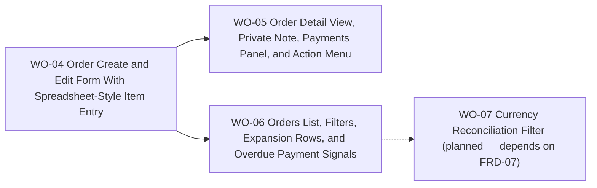

# BP-02 Order Workspace and List Experience

## Purpose

Define how collectors create, inspect, edit, filter, and act on orders across the private workspace.

## Runtime Components

- order routes under `src/app/[locale]/(app)/orders`
- order detail route and route-level components
- shared searchable select for store input
- spreadsheet-style item-entry component
- private note component patterned after `Stores`
- expandable order cards and filter sidebar components

## Architecture Decisions

- Orders should use expandable cards rather than a rigid table so the same surface can carry status chips, overdue signals, payment progress, and mobile-friendly expansion.
- The order create/edit form should place the item spreadsheet last so the user establishes the order context before entering many line items.
- The order detail view should keep the private note editable outside full edit mode, matching the mental model already established in `Stores`.
- Action overload should be reduced by using one primary action and one secondary affordance. When edit is the clearly dominant secondary task, that affordance should be a split pattern: visible `Edit` plus a small adjacent overflow trigger for the remaining actions.
- The detail-view action bar must adapt to the order status so collectors always see a meaningful primary action:
  - `OPEN`, `PARTIALLY_IN_TRANSIT`, `IN_TRANSIT`, `PARTIALLY_DELIVERED`: primary `Create delivery` · visible `Edit` · overflow with `View store`, `Cancel`, and `Delete`.
  - `COMPLETED`: same visible layout as above; overflow still includes `View store`, while `Cancel` and `Delete` remain visible but disabled with a tooltip that explains the eligibility rule.
  - `CANCELLED`: primary `Reactivate` · `More` with `View store` and `Delete` only (edit is not offered on cancelled orders; reactivate first if the collector needs to mutate data).
- The detail view uses a two-column layout on `lg` and above: **left** column — order **items** list, then **private note** (`space-y-8`). **Right** column (sticky) — **payment summary + payment list/add form** (`OrderPaymentsPanel`), then **read-only order history** in a `SectionSurfaceCard` matching the payments card styling (`space-y-4` between the two). The page **header** spans full width above the grid. On smaller breakpoints the grid stacks: **header → items → note → payments → history** (no sticky rail; natural document order). See [`WO-05`](work-orders/wo-05-order-detail-view-private-note-payments-panel-and-action-menu.md).
- Product-name search belongs inside the filter sidebar as one free-text filter rather than a global omnibox.
- The orders list applies a default status filter of active orders (`OPEN`, `PARTIALLY_IN_TRANSIT`, `IN_TRANSIT`, `PARTIALLY_DELIVERED`) when no filter state is present in the URL. This keeps the collector focused on orders that need attention without requiring manual setup on every visit. The route canonicalizes to an explicit query string with those four `status` params, the filter UI shows a grouped `Solo activas` chip, and the status options inside the filter sidebar remain checked to match the visible results. The `Restablecer` button returns to that explicit default active-orders URL and appears only when at least one filter beyond the default active view is currently applied.
- The back link from the order detail page to the orders list uses a `?returnTo=` query parameter carrying the encoded previous list URL. This preserves the collector's filter and pagination state across the list → detail → list navigation cycle, consistent with the `?returnTo=order-create` redirect contract already used in the order create flow.
- The order detail page exposes `View store` inside the `More` menu. That link passes the full current order-detail URL through `?returnTo=` to the store detail route so the store page back link can return the collector to the same order detail context.

## Contracts

- order form contract:
  - input: order foundation data plus item rows
  - output: validated create or edit payload
  - store field is the first input so the collector discovers a missing store before filling other data
- store-creation redirect contract:
  - when the collector triggers "Create store" from the store selector, the redirect carries `?returnTo=order-create` so the store creation flow can return the user to order create instead of the default store list
  - if the collector typed a store name that yielded no results, the redirect also carries `&name={value}` to prefill the store name field
  - after the store is saved, the collector is redirected to `/orders/new?store={id}` with the new store preselected
- detail action contract:
  - input: current order state, payment records, delivery associations, and feature-flag-style availability (for example whether the delivery-create flow is live)
  - output: availability and disabled-state reasons for `Create delivery`, `Edit`, `View store`, `Cancel`, `Delete`, and `Reactivate` so the UI can render each affordance enabled, disabled with tooltip, or hidden according to the status-driven action bar above
  - shared eligibility rule: `Cancel` and `Delete` share the same block condition — at least one item linked to a non-cancelled delivery — and must surface the same unlink-first tooltip when disabled
- list filter contract:
  - input: date range, store, product type, status, free-text product query, `fxStatus` reconciliation flag
  - output: URL-canonical filter state plus result chips
  - `fxStatus=needs_reconciliation` maps to `needsExchangeRateUpdate: true` in the Prisma query; handled by `parseOrderListingParams` in `src/app/[locale]/(app)/orders/_utils/orderListingParams.ts`
  - `FxReconciliationModal` at `src/components/modules/FxReconciliationModal.tsx` is the reconciliation entry point; triggered from the orders list banner and from the Settings currency-change confirmation

## Operational Priorities

- fast keyboard entry
- clear action hierarchy
- compact but readable status signals
- URL-driven list state
- mobile-safe expansion patterns

## Dependencies

- `BP-01` order persistence and summary contracts
- store selection and catalog data from [`FRD-04`](../../frd-04-store-domain/frd-04-store-domain.md)
- base-currency preference defaults from [`FRD-07`](../../frd-07-user-settings/frd-07-user-settings.md)

## Risks

- spreadsheet keyboard support can become fragile if the component also takes on too many visual responsibilities
- a crowded detail header can regress clarity if action hierarchy is not enforced strictly
- free-text product search can be misleading if matching rules are not documented consistently

## Extension Points

- richer saved views for orders
- dashboard deep links back into filtered order lists
- bulk order actions in a later admin-like workflow

## Implementation Plan

- `WO-04` must happen first because the detail and list experiences both depend on the finalized form inputs and item-entry behavior.
- After `WO-04`, `WO-05` and `WO-06` can progress in parallel.
- `WO-05` should still reuse payment contracts from `BP-01 / WO-03` once they land.
- `WO-07` covers `FR-05-36` through `FR-05-38` (the `Needs currency update` filter and bulk FX reconciliation flow). It is explicitly out of scope for `WO-06` and depends on FRD-07 WO-05 being complete.

## Linked Work Orders

- `work-orders/wo-04-order-create-and-edit-form-with-spreadsheet-style-item-entry.md`
- `work-orders/wo-05-order-detail-view-private-note-payments-panel-and-action-menu.md`
- `work-orders/wo-06-orders-list-filters-expansion-rows-and-overdue-payment-signals.md`
- `work-orders/wo-07-currency-reconciliation-filter-and-bulk-fx-reconciliation.md`
