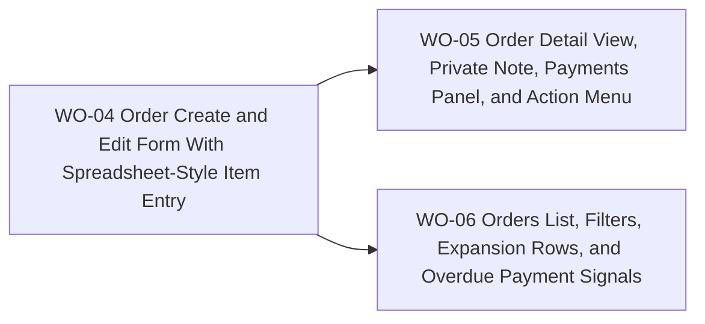

# BP-02 Order Workspace and List Experience

## Purpose

Define how collectors create, inspect, edit, filter, and act on orders across the private workspace.

## Runtime Components

- order routes under `src/app/[locale]/(app)/purchases`
- order detail route and route-level components
- shared searchable select for store input
- spreadsheet-style item-entry component
- private note component patterned after `Stores`
- expandable order cards and filter sidebar components

## Architecture Decisions

- Orders should use expandable cards rather than a rigid table so the same surface can carry status chips, overdue signals, payment progress, and mobile-friendly expansion.
- The order create/edit form should place the item spreadsheet last so the user establishes the order context before entering many line items.
- The order detail view should keep the private note editable outside full edit mode, matching the mental model already established in `Stores`.
- Action overload should be reduced by using one primary action, one secondary action, and a `More` menu for destructive actions.
- Product-name search belongs inside the filter sidebar as one free-text filter rather than a global omnibox.

## Contracts

- order form contract:
  - input: order foundation data plus item rows
  - output: validated create or edit payload
- detail action contract:
  - input: current order state and dependencies
  - output: available actions for create-delivery, edit, cancel, and delete
- list filter contract:
  - input: date range, store, product type, status, free-text product query
  - output: URL-canonical filter state plus result chips

## Operational Priorities

- fast keyboard entry
- clear action hierarchy
- compact but readable status signals
- URL-driven list state
- mobile-safe expansion patterns

## Dependencies

- `BP-01` order persistence and summary contracts
- store selection and catalog data from `FRD-04`
- base-currency preference defaults from `FRD-07`

## Risks

- spreadsheet keyboard support can become fragile if the component also takes on too many visual responsibilities
- a crowded detail header can regress clarity if action hierarchy is not enforced strictly
- free-text product search can be misleading if matching rules are not documented consistently

## Extension Points

- richer saved views for orders
- dashboard deep links back into filtered order lists
- bulk order actions in a later admin-like workflow

## Implementation Plan

- `WO-04` must happen first because the detail and list experiences both depend on the finalized form inputs and item-entry behavior.
- After `WO-04`, `WO-05` and `WO-06` can progress in parallel.
- `WO-05` should still reuse payment contracts from `BP-01 / WO-03` once they land.

## Linked Work Orders

- `work-orders/wo-04-order-create-and-edit-form-with-spreadsheet-style-item-entry.md`
- `work-orders/wo-05-order-detail-view-private-note-payments-panel-and-action-menu.md`
- `work-orders/wo-06-orders-list-filters-expansion-rows-and-overdue-payment-signals.md`
