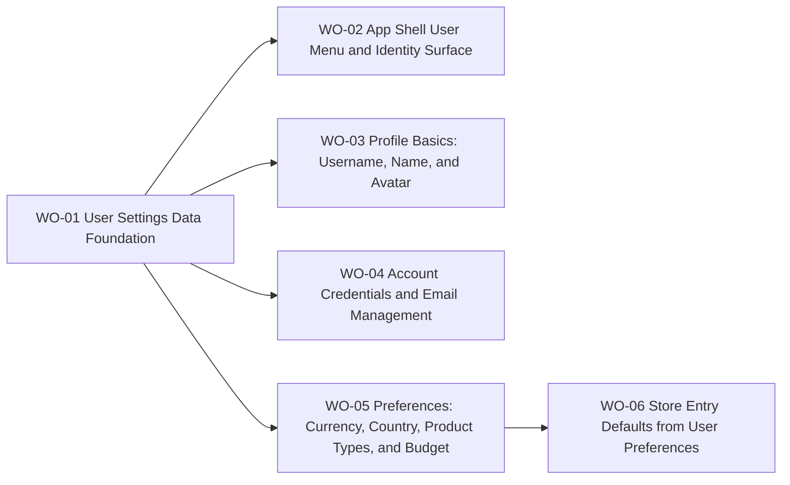

# BP-01 User Settings, Identity, and Preferences

## Purpose

Describe the technical layer that powers profile editing, account-management controls, collector preferences, and preference-driven store-entry defaults in the PandaTrack MVP.

## Runtime Components

- private app shell components under `src/app/[locale]/(app)/_components/AppLayout`
- settings route UI under `src/app/[locale]/(app)/settings`
- user settings server actions, schemas, and query modules
- Better Auth server/client integration for password and email flows
- Prisma persistence for user identity and preference data
- Cloudflare R2 object storage for user-uploaded profile images
- store-listing entry-link construction in the private navigation flow

## Architecture Decisions

- One settings route should host both `Profile` and `Preferences` sections to keep account management discoverable without splitting navigation depth.
- Username becomes a first-class identity field separate from display name and email.
- The canonical shell identity trigger lives in the lower navigation area:
  - desktop expanded sidebar: avatar plus username above the expand/collapse control
  - desktop collapsed sidebar: keep the avatar or fallback visible in the lower rail and reveal the full trigger when hover/focus expansion opens the sidebar
  - mobile/tablet drawer: the same trigger replaces the lower sign-out-only control
- The account menu should open upward from the lower navigation area on desktop so the trigger and menu remain visually paired.
- The mobile/tablet drawer should reuse the same content model through an inline anchored menu instead of a floating overlay.
- One shared account-menu component should power desktop and mobile placements.
- Username uniqueness is enforced case-insensitively at the system boundary even if the stored display value preserves casing.
- Username must be generated during server-side account creation so every newly created account already has a valid persisted username before reaching the private app.
- Reserved names, PandaTrack brand protections, and blocked tokens for usernames are maintained in code/config for MVP.
- Display name remains a separate non-unique profile field with `trim`, a `50` character maximum, and the same reserved-name, PandaTrack brand, and blocked-token protections as username.
- Avatar upload should reuse the existing image-crop and optimization interaction already established for store logos.
- `User.image` is the effective avatar URL in MVP:
  - provider-hosted URLs may remain the initial value for Google-created accounts
  - once the collector uploads a replacement, the field must point to the Cloudflare R2 asset URL
  - removing the effective avatar always clears the field and returns the UI to the username-initial fallback instead of restoring a provider image automatically
- User-managed avatar assets use the stable object key `user-images/{userId}.webp` so replacements overwrite the current file in MVP.
- Successful profile-basic saves must update the settings preview and shell identity surfaces immediately in client state without a full page refresh.
- Email-change rules must branch by account-provider posture:
  - credential-only: email change allowed
  - Google-only: email change blocked
  - Google plus credentials: email change blocked in MVP
- Account-management capabilities for later settings slices must be derived at runtime from auth/account posture rather than persisted as duplicated capability flags.
- `user.changeEmail.enabled: true` must be set in `src/lib/auth/auth.ts` for the email change flow to work. `sendChangeEmailConfirmation` is intentionally not configured — the verification link goes directly to the new email via `sendVerificationEmail`; the informational notification to the old address is sent via a direct Resend call in the server action.
- `auth.api.setPassword` (server-only) is the correct Better Auth endpoint for Google-only users adding a password. `changePassword` cannot be used for this case because it requires `currentPassword` as a mandatory field.
- When a user confirms an email change via the verification link, Better Auth sets `emailVerified = false`. This is expected and intentional: it activates the existing seven-day verification banner lifecycle for the new email address.
- The settings page exposes three sections in MVP: `Profile`, `Account`, and `Preferences`. `Account` is a distinct section that owns all email and password management controls.
- Budget persistence lives on `User` in MVP and is intentionally limited to one active budget, accepting a later migration if multi-budget support becomes necessary.
- Preference-driven store defaults should be implemented as URL generation from navigation entry points rather than hidden server-side filtering so the listing remains URL-canonical.
- Privacy Policy and Terms and Conditions links stay visible inside the user menu as shell-level trust and compliance exits.
- `Settings` should live in the account menu rather than in the primary shell navigation once this slice ships.

## Contracts

- Shell identity contract:
  - input: authenticated user session plus resolved username/image
  - output: avatar, username, lower-shell trigger, desktop floating menu actions, mobile inline menu actions
- Username-edit contract:
  - input: candidate username
  - output: format-valid state, availability state, save eligibility, persisted username
- Display-name contract:
  - input: candidate display name
  - output: trimmed persisted display name or validation rejection for reserved-name, brand-protected, blocked-token, or length violations
- Username-foundation contract:
  - input: new authenticated account plus email local part
  - output: persisted valid username, persisted normalized uniqueness value, collision-safe fallback handling
- Avatar contract:
  - input: provider image URL or source image up to 10 MB
  - output: effective avatar URL in `User.image`, with cropped optimized asset in `user-images/{userId}.webp` when the collector uploads a replacement, immediate client-side identity refresh after successful changes, and username-initial fallback after successful removal
- Account-management contract:
  - input: auth-method posture plus email/password change request plus current password for email-change operations
  - output: allowed action set and any verification lifecycle restart
  - email change requires: manual current-password validation in server action before calling `auth.api.changeEmail`; rate-limit check (1 per 7 days per user); informational Resend notification to old address after Better Auth accepts the request; verification link to new address via existing `sendVerificationEmail` handler
  - password setup for Google-only users uses `auth.api.setPassword` (server-only); creates a new `Account` row with `providerId: "credential"` without requiring a current password
  - password change for credential-bearing users uses `auth.api.changePassword` with `revokeOtherSessions: false`
  - active session is not revoked after an email change; `User.email` remains the old value until the user clicks the verification link; Better Auth sets `emailVerified = false` on link confirmation, which activates the existing banner lifecycle
- Account-capability contract:
  - input: authenticated user plus linked auth accounts
  - output: runtime capability set for `changeEmail`, `changePassword`, `setPassword`, and blocked-state messaging
- Preference contract:
  - input: country, base currency, preferred product types, budget amount, budget reset rule
  - output: saved user-owned preference fields and navigation defaults for `Stores`
  - base currency change: requires explicit user confirmation that orders affecting current and future budget periods may need currency reconciliation; flow should offer bulk update by currency pair and allow deferred manual reconciliation
  - budget amount: positive integer in whole units of the active base currency only (no fractional subunits)
  - budget period boundary: evaluate reset logic in user timezone when available, fallback to `UTC`
  - preferred product types: many-to-many link rows between `User` and `StoreProductType` (no duplicate catalog)

## Operational Priorities

- identity clarity in the shell
- cross-device navigation consistency between desktop sidebar and mobile drawer
- safe auth-method handling
- low-friction profile editing
- deterministic URL-driven store discovery behavior
- reuse of existing upload and verification infrastructure

## Dependencies

- Better Auth account/session foundation from `FRD-01`
- current shell layout and navigation components from `FRD-03`
- seeded `Country` and `StoreProductType` catalogs from `FRD-04`
- future dashboard/reporting consumers of base currency and budget defaults from `FRD-06`

## Risks

- case-insensitive username uniqueness can be implemented incorrectly if persistence and validation normalization diverge
- signup can become brittle if username generation is not collision-safe and atomic
- account-provider edge cases can create confusing UX if Google-linked users are offered unsupported email actions
- image upload reuse can drift if the store-logo pipeline is copied instead of shared
- avatar cleanup can leave orphaned storage objects if R2 deletion fails after `User.image` is cleared, so observability must cover that path
- storing all MVP preference and budget fields on `User` increases pressure to keep naming and query boundaries disciplined for future migration
- preference-driven store defaults can feel surprising if the navigation-generated URL and direct URL entry rules are not explicit
- the email change server action must validate the current password manually before calling `auth.api.changeEmail`; omitting this step allows session hijacking to result in an account email takeover
- the rate limit for email change must be enforced server-side; a missing or bypassable check exposes the system to spam and enumeration via the new-email verification flow
- the informational Resend call to the old address can fail silently after `auth.api.changeEmail` succeeds; observability must cover this path so orphaned changes without notification are detectable
- the lower-shell account trigger can feel inconsistent if expanded sidebar, collapsed hover state, and mobile drawer do not share the same interaction and menu ordering
- removing `Settings` from primary navigation can hurt discoverability if the account trigger is not visually obvious in both expanded and collapsed states

## Extension Points

- public profile pages keyed by username
- additional OAuth providers
- multiple budgets
- richer personalization based on saved collector preferences
- notification preferences once product-side unsubscribe controls become a requirement

## Implementation Plan

- `WO-01` must land first because it defines the persistence and validation contracts used by every later slice.
- After `WO-01`, `WO-02`, `WO-03`, `WO-04`, and `WO-05` can run in parallel because they depend on the same shared foundation but own different user outcomes.
- `WO-06` must happen after `WO-05` because it consumes saved preferences to build default store-entry URLs.
- `WO-02` should establish the reusable lower-shell account-menu primitive that later settings slices can rely on for discoverability.
- If execution uncovers provider-account complexity that changes the email or password rules, update this blueprint before enriching or implementing the dependent work orders.

## Linked Work Orders

- `work-orders/wo-01-user-settings-data-foundation.md`
- `work-orders/wo-02-app-shell-user-menu-and-identity-surface.md`
- `work-orders/wo-03-profile-basics-username-name-and-avatar.md`
- `work-orders/wo-04-account-credentials-and-email-management.md`
- `work-orders/wo-05-preferences-currency-country-product-types-and-budget.md`
- `work-orders/wo-06-store-entry-defaults-from-user-preferences.md`
