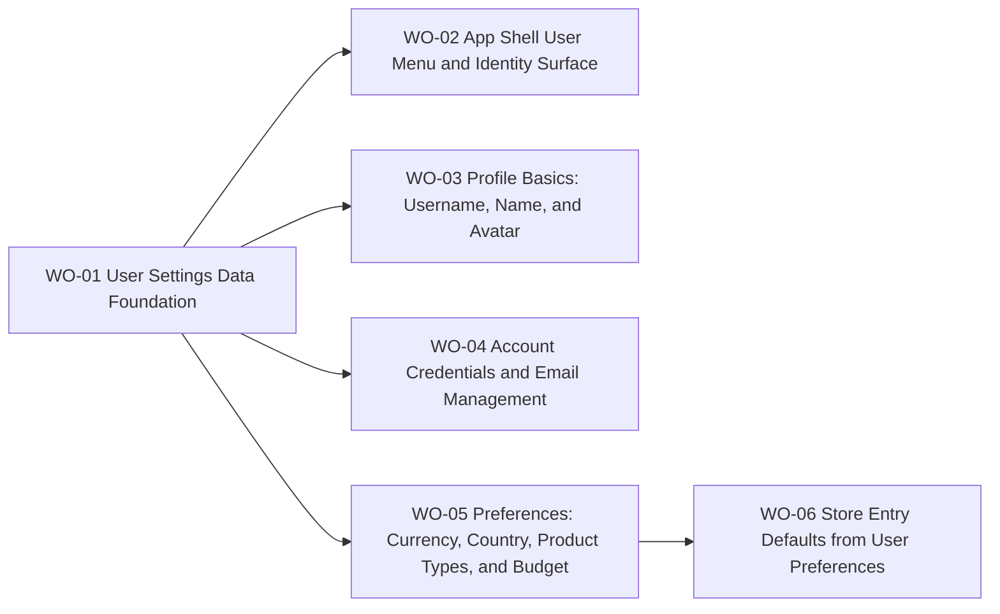

# BP-01 User Settings, Identity, and Preferences

## Purpose

Describe the technical layer that powers profile editing, account-management controls, collector preferences, and preference-driven store-entry defaults in the PandaTrack MVP.

## Runtime Components

- private app shell components under `src/app/[locale]/(app)/_components/AppLayout`
- settings route UI under `src/app/[locale]/(app)/settings`
- user settings server actions, schemas, and query modules
- Better Auth server/client integration for password and email flows
- Prisma persistence for user identity and preference data
- Cloudflare R2 object storage for user-uploaded profile images
- store-listing entry-link construction in the private navigation flow

## Architecture Decisions

- One settings route should host both `Profile` and `Preferences` sections to keep account management discoverable without splitting navigation depth.
- Username becomes a first-class identity field separate from display name and email.
- Username uniqueness is enforced case-insensitively at the system boundary even if the stored display value preserves casing.
- Avatar upload should reuse the existing image-crop and optimization interaction already established for store logos.
- Email-change rules must branch by account-provider posture:
  - credential-only: email change allowed
  - Google-only: email change blocked
  - Google plus credentials: email change blocked in MVP
- Budget persistence should be modeled so that a future multi-budget expansion does not require rethinking the persistence layer.
- Preference-driven store defaults should be implemented as URL generation from navigation entry points rather than hidden server-side filtering so the listing remains URL-canonical.

## Contracts

- Shell identity contract:
  - input: authenticated user session plus resolved username/image
  - output: avatar, username, menu actions
- Username-edit contract:
  - input: candidate username
  - output: format-valid state, availability state, save eligibility, persisted username
- Avatar contract:
  - input: source image up to 10 MB
  - output: cropped optimized asset in `user-images`, stored URL in user record
- Account-management contract:
  - input: auth-method posture plus email/password change request
  - output: allowed action set and any verification lifecycle restart
- Preference contract:
  - input: country, base currency, preferred product types, budget amount, budget reset rule
  - output: saved user preference record and navigation defaults for `Stores`

## Operational Priorities

- identity clarity in the shell
- safe auth-method handling
- low-friction profile editing
- deterministic URL-driven store discovery behavior
- reuse of existing upload and verification infrastructure

## Dependencies

- Better Auth account/session foundation from `FRD-01`
- current shell layout and navigation components from `FRD-03`
- seeded `Country` and `StoreProductType` catalogs from `FRD-04`
- future dashboard/reporting consumers of base currency and budget defaults from `FRD-06`

## Risks

- case-insensitive username uniqueness can be implemented incorrectly if persistence and validation normalization diverge
- account-provider edge cases can create confusing UX if Google-linked users are offered unsupported email actions
- image upload reuse can drift if the store-logo pipeline is copied instead of shared
- preference-driven store defaults can feel surprising if the navigation-generated URL and direct URL entry rules are not explicit

## Extension Points

- public profile pages keyed by username
- additional OAuth providers
- multiple budgets
- richer personalization based on saved collector preferences
- notification preferences once product-side unsubscribe controls become a requirement

## Implementation Plan

- `WO-01` must land first because it defines the persistence and validation contracts used by every later slice.
- After `WO-01`, `WO-02`, `WO-03`, `WO-04`, and `WO-05` can run in parallel because they depend on the same shared foundation but own different user outcomes.
- `WO-06` must happen after `WO-05` because it consumes saved preferences to build default store-entry URLs.
- If execution uncovers provider-account complexity that changes the email or password rules, update this blueprint before enriching or implementing the dependent work orders.

## Linked Work Orders

- `work-orders/wo-01-user-settings-data-foundation.md`
- `work-orders/wo-02-app-shell-user-menu-and-identity-surface.md`
- `work-orders/wo-03-profile-basics-username-name-and-avatar.md`
- `work-orders/wo-04-account-credentials-and-email-management.md`
- `work-orders/wo-05-preferences-currency-country-product-types-and-budget.md`
- `work-orders/wo-06-store-entry-defaults-from-user-preferences.md`
