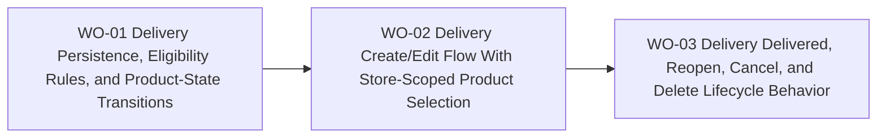

# BP-01 Delivery Domain and Product Allocation

## Purpose

Define the persistence, eligibility, and lifecycle rules that let one delivery group products from multiple orders of the same store.

## Runtime Components

- Prisma models for deliveries and delivery-linked product state
- delivery query and mutation modules
- reusable eligibility queries scoped by store and product state
- state-transition helpers for arrived-at-store, in-transit, delivered, reopened, cancelled, and deleted flows

## Architecture Decisions

- Delivery should operate on order products, not whole orders, because partial grouping is fundamental to the domain.
- Eligibility must be query-driven so ineligible products never appear in the selector.
- Product delivery state must be recalculated from delivery actions instead of requiring manual repair steps.
- Cancel and delete stay separate so the user can either preserve or discard the delivery record intentionally.
- Reopen should be explicit so delivered shipments can be corrected without inventing a second "edit after delivered" mode.

## Contracts

- eligibility contract:
  - input: store id
  - output: eligible products grouped by source order
- create/edit contract:
  - input: store, delivery date, estimated range, cost, currency, optional FX, optional carrier, optional tracking, selected product ids
  - output: persisted delivery plus recalculated product states
- lifecycle contract:
  - input: mark delivered, reopen, cancel, delete, edit-product-membership
  - output: updated delivery state and updated product states

## Operational Priorities

- strict one-store boundary
- safe product-state recalculation
- predictable eligibility
- easy correction flows

## Dependencies

- order-product model from `FRD-05`
- user base-currency preference from `FRD-07`
- private app route shell from `FRD-03`

## Risks

- reopen and edit flows can create inconsistent product states if the recalculation logic is not centralized
- selector queries can become expensive if grouped order-product loading is not shaped carefully
- delete and cancel semantics can confuse users if the state rollback is not visible enough in the UI

## Extension Points

- future carrier integrations
- future delivery-cost analytics
- future shipment milestones beyond `IN_TRANSIT` and `DELIVERED`

## Implementation Plan

- `WO-01` must happen first because every create, edit, and lifecycle screen depends on eligibility and recalculation rules.
- `WO-02` must happen after `WO-01` because the selector and preselection UX need the eligibility contract.
- `WO-03` must happen after `WO-02` because delivered, reopen, cancel, and delete flows all depend on the working create/edit model.

## Linked Work Orders

- `work-orders/wo-01-delivery-persistence-eligibility-rules-and-product-state-transitions.md`
- `work-orders/wo-02-delivery-create-edit-flow-with-store-scoped-product-selection.md`
- `work-orders/wo-03-delivery-delivered-reopen-cancel-and-delete-lifecycle-behavior.md`
