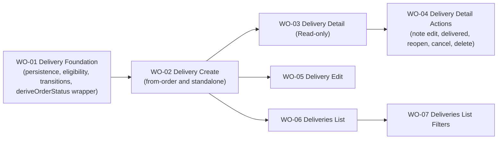

# BP-01 Delivery Management

## Purpose

Define the end-to-end delivery experience: persistence, eligibility, product-state transitions, create/edit flows, detail view, detail actions, list, and filtering. One single blueprint covers the full vertical of the delivery domain for the collector MVP.

## Runtime Components

- Prisma models for deliveries and delivery-linked product state
- delivery query and mutation modules under `src/lib/data/deliveries/`
- shared eligibility query (products by store, excluding ineligible)
- shared product-state transition helpers (arrived-at-store, in-transit, delivered)
- `deriveOrderStatus` integration wrapper (calls the pure function from [`FRD-05 · BP-01 · WO-02`](../../frd-05-order-payment-shipment/bp-01-order-domain-foundation/work-orders/wo-02-order-item-model-totals-fx-and-derived-order-state-rules.md) within the same transaction as any delivery mutation)
- delivery routes under `src/app/[locale]/(app)/shipments`
- delivery detail route and route-level components
- delivery create and edit routes (single form, mode-aware)
- expandable delivery cards in the list
- filter sidebar patterned after `Stores`
- inline private-note component patterned after order and store notes

## Architecture Decisions

- The delivery domain is one coherent vertical, cut as a single blueprint with a thin foundation slice followed by vertical user-facing slices. There is no separate "backend blueprint" and "frontend blueprint".
- Delivery operates on order products, not whole orders, because partial grouping across orders is fundamental to the domain.
- Eligibility is query-driven: ineligible products never appear in the selector instead of being shown as disabled options.
- Product delivery state is recalculated from delivery actions. There are no manual repair steps.
- Cancel and delete stay separate: cancel preserves the delivery with `CANCELLED`, delete removes the record entirely where delete rules allow it.
- Reopen is explicit so delivered shipments can be corrected without inventing a second "edit after delivered" mode.
- Delivery detail uses expandable cards, one inline-editable private note, and no automatic history timeline in MVP, for visual and interaction parity with orders.
- Product-name search remains a list-filter concern rather than a separate top-level search surface.
- Every delivery mutation that changes product-to-delivery associations (create, edit, mark delivered, reopen, cancel, delete) must call `deriveOrderStatus` for every affected order and persist the result within the same transaction.

## Contracts

- eligibility contract
  - input: store id, (optional) source order id for preselection
  - output: eligible products grouped by source order, excluding products that are already delivered or already attached to another active delivery
- create/edit contract
  - input: store, delivery date, expected arrival range, cost, currency, optional FX, optional carrier, optional tracking, selected product ids
  - output: persisted delivery, recalculated product states, and re-derived `OrderStatus` for every affected order
- lifecycle contract
  - input: `markDelivered`, `reopen`, `cancel`, `delete`, `updatePrivateNote`, and `updateProductMembership` (from edit)
  - output: updated delivery state, updated product states, and re-derived `OrderStatus` for every affected order
- detail read contract
  - input: delivery id
  - output: delivery summary, grouped products by source order, current lifecycle state, action availability flags, and the private note value
- list filter contract
  - input: store, product-name text, date range
  - output: URL-canonical filter state and removable chips patterned after `Stores`

## Operational Priorities

- strict one-store boundary per delivery
- safe and centralized product-state recalculation
- predictable eligibility
- easy correction flows (edit and reopen)
- visual parity with orders
- filter persistence through the URL

## Dependencies

- order-product model from [`FRD-05`](../../frd-05-order-payment-shipment/frd-05-order-payment-shipment.md)
- `deriveOrderStatus` pure function from [`FRD-05 · BP-01 · WO-02`](../../frd-05-order-payment-shipment/bp-01-order-domain-foundation/work-orders/wo-02-order-item-model-totals-fx-and-derived-order-state-rules.md) — must be called and the result persisted within every delivery mutation that changes product delivery associations
- user base-currency preference from [`FRD-07`](../../frd-07-user-settings/frd-07-user-settings.md)
- private app route shell from [`FRD-03`](../../frd-03-collector-app-shell/frd-03-collector-app-shell.md)

## Risks

- reopen and edit flows can create inconsistent product states if the recalculation logic is not centralized in shared helpers consumed by every mutation
- eligibility queries can become expensive if grouped order-product loading is not shaped carefully
- delete and cancel semantics can confuse users if the state rollback is not visible enough in the UI
- grouped product cards can become visually noisy if order identifiers and eligibility signals are not compact
- reopening delivered shipments can create misleading UI if action affordances do not reflect the new editable state immediately

## Extension Points

- future carrier integrations
- future delivery-cost analytics
- future shipment milestones beyond `IN_TRANSIT` and `DELIVERED`
- future dashboard deep links and saved filtered views
- future delivery history timeline if collector demand justifies it

## Implementation Plan

- `WO-01` is the foundation slice: Prisma schema, enums, Zod schemas, eligibility helpers, product-state transition helpers, and the `deriveOrderStatus` integration wrapper. No UI, no routes. It is the only slice exempt from the "must include an E2E acceptance path" rule because by design it ships no UI; it is validated with unit tests.
- `WO-02` Delivery Create must happen immediately after `WO-01` because every downstream slice assumes delivery records can exist.
- After `WO-02`, three slices unlock in parallel: `WO-03` (detail read-only), `WO-05` (edit), and `WO-06` (list). They can be implemented concurrently.
- `WO-04` (detail actions) depends on `WO-03` because it operates from the detail view surface.
- `WO-07` (filters) depends on `WO-06` (list).

## Linked Work Orders

- `work-orders/wo-01-delivery-foundation.md`
- `work-orders/wo-02-delivery-create.md`
- `work-orders/wo-03-delivery-detail-read-only.md`
- `work-orders/wo-04-delivery-detail-actions.md`
- `work-orders/wo-05-delivery-edit.md`
- `work-orders/wo-06-deliveries-list.md`
- `work-orders/wo-07-deliveries-list-filters.md`
