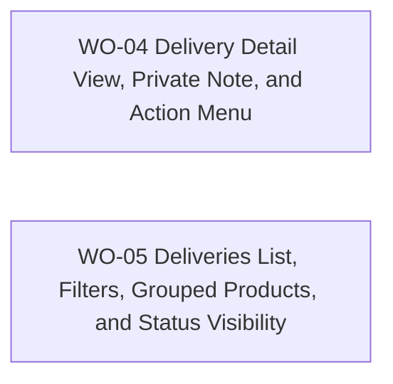

# BP-02 Delivery Workspace and List Experience

## Purpose

Define how collectors inspect, act on, and filter deliveries across the private workspace.

## Runtime Components

- delivery routes under `src/app/[locale]/(app)/shipments`
- delivery detail route and route-level components
- expandable delivery cards
- filter sidebar patterned after `Stores`
- private note component patterned after order and store notes

## Architecture Decisions

- Delivery list should use expandable cards, not rigid tables, for parity with orders and better mobile readability.
- Delivery actions should mirror the order detail hierarchy so collectors learn one interaction pattern for both domains.
- Delivery detail should include one inline-editable private note and no automatic history timeline in MVP.
- Product-name search should remain a filter-sidebar concern rather than a separate top-level search surface.

## Contracts

- detail contract:
  - input: delivery summary, grouped products, note, and lifecycle state
  - output: expandable summary plus action availability
- list filter contract:
  - input: store, product-name text, and date range
  - output: URL-canonical filter state and removable chips

## Operational Priorities

- visual parity with orders
- compact grouped-product presentation
- action clarity
- filter persistence

## Dependencies

- `BP-01` eligibility, persistence, and lifecycle rules
- shared app-shell patterns from `FRD-03`

## Risks

- grouped product cards can become visually noisy if order identifiers and eligibility signals are not compact
- reopening delivered shipments can create misleading UI if action affordances do not reflect the new editable state immediately

## Extension Points

- later dashboard deep links
- saved filtered views
- future delivery history timeline if collector demand justifies it

## Implementation Plan

- `WO-04` and `WO-05` can begin after `BP-01 / WO-02` provides the working create/edit and eligibility contracts.
- `WO-04` should integrate lifecycle actions from `BP-01 / WO-03` as soon as those contracts land.
- `WO-05` should reflect the same status and grouping decisions established in detail view so list and detail remain consistent.

## Linked Work Orders

- `work-orders/wo-04-delivery-detail-view-private-note-and-action-menu.md`
- `work-orders/wo-05-deliveries-list-filters-grouped-products-and-status-visibility.md`
