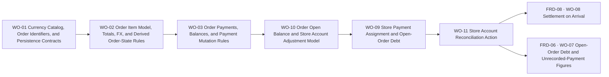

# BP-01 Order Domain Foundation

## Purpose

Define the persistence, state, and monetary contracts that make order and payment behavior coherent before any list or detail experience is layered on top.

## Runtime Components

- Prisma models for orders, order items, payments, private notes, history entries, and currencies
- order query modules and mutation modules under the private app data layer
- validation schemas for create, edit, pay, delete, and cancel flows
- shared money and identifier helpers in `src/lib`
- detail-view data loaders that join store, item, payment, and derived summary information
- **(added 2026-08-20, `ADR 0034`, `WO-10`):** `StoreAccountAdjustment` and
  `StoreAccountAdjustmentLine`, the reconciliation adjustment's own models. The header carries
  store, user, currency, a server-forced `adjustmentDate` and a required `reason`, and **stores no
  total at all**: an adjustment's magnitude is the sum of its own lines, derived at read time. Each
  **line** names one order and an unsigned amount (`CHECK > 0`) capped at that order's own open
  balance, `@@unique` per (adjustment, order), cascading from both its adjustment and its order.
  Neither is a `StorePayment` and neither has `PaymentAllocation` children, so an adjustment never
  enters any allocation-based figure and never credits an order's own payment ledger. See
  `work-orders/wo-10-order-open-balance-and-store-account-adjustment-model.md`.
- **(added 2026-08-20, `ADR 0034` §3.1, `WO-10`):** `src/lib/data/orders/orderOpenBalance.ts`, the
  single module that derives an order's canonical open balance,
  `openBalanceMinor = totalCost − Σ PaymentAllocation.amountMinor − Σ StoreAccountAdjustmentLine.amountMinor`,
  and its complement `declaredAgainstOrderMinor = Σ allocations + Σ lines`. It exists because the
  adjustment line is a **third term** in that balance and the write paths that predate it stop at
  the allocations; one module means no caller can read the figure over three terms while its
  neighbour reads it over two. See `BR-05-32` for the seven mandatory consumers.
- **(added 2026-08-20, `WO-08`):** `StorePayment.settledByDeliveryId` (nullable, FK to `Delivery`,
  `onDelete: Restrict`) records that a payment was raised by the delivery-triggered settlement flow
  rather than typed by hand. The field and its write path belong to
  [`FRD-08 · WO-08`](../../frd-08-delivery-management/bp-01-delivery-management/work-orders/wo-08-settlement-on-arrival.md);
  it is documented here because it lives on this blueprint's own `StorePayment` model.

## Architecture Decisions

- Currency is not stored in a dedicated database table. The permitted currency set is the hardcoded allowlist `ALLOWED_COLLECTOR_BASE_CURRENCY_CODES` defined in `src/lib/catalog/collectorCountries.ts`, reusing the same catalog and Zod validator already in use by user settings. Localized currency names are resolved in the UI from the existing `currencies.{code}` i18n keys.
- Exchange-rate context should be stored once per order in MVP so reporting and derived totals have one stable conversion basis.
- Order status is derived, not directly editable, and exposes six states: `OPEN`, `PARTIALLY_IN_TRANSIT`, `IN_TRANSIT`, `PARTIALLY_DELIVERED`, `COMPLETED`, and `CANCELLED`. The pure function `deriveOrderStatus` (defined in WO-02) owns the derivation algorithm. Delivery mutations in [`FRD-08`](../../frd-08-delivery-management/frd-08-delivery-management.md) are responsible for calling it and persisting the result.
- Order identifiers should be generated at persistence time using a deterministic date-based prefix plus a two-digit daily sequence.
- Payment progress should be derived from payment records instead of duplicated into manually edited columns.
- Order history should be append-oriented and human-readable. **As implemented (2026-04-24):** the app does not expose per-entry user deletion of history rows on the order detail view (`deleteOrderHistoryEntry` removed); history remains a read-only audit trail in the UI. See [`FRD-05`](../frd-05-order-payment-shipment.md) `FR-05-22` / `BR-05-09` and [`BP-02 · WO-05`](../bp-02-order-workspace-and-list-experience/work-orders/wo-05-order-detail-view-private-note-payments-panel-and-action-menu.md).
- **(added 2026-08-20, `ADR 0033`, `WO-09`):** The store debt figure the collector SEES counts only
  open orders (the four non-terminal `OrderStatus` values). A fully `COMPLETED` order leaves the
  figure together with its own payments, never one without the other, because this market never
  lets a store hand over goods before it is paid in full: a delivered order carrying a balance is a
  registration gap, not a real debt. The figure that VALIDATES a new payment (`STORE_DEBT_EXCEEDED`)
  stays the full lifetime debt, including delivered orders, so a late payment on an already-closed
  order keeps working. Closing an order automatically consumes up to `min(its own remaining balance,
the store's unassigned money in that currency)` so it never leaves debt behind uncollected in its
  own store's unassigned pool.
- **(added 2026-08-20, `ADR 0034`, `WO-10`):** A reconciliation adjustment ("cuadrar cuenta") is
  **its own record type**, `StoreAccountAdjustment`, never a `StorePayment` carrying a flag. The
  decisive reason comes from another domain: [`FRD-06`](../../frd-06-dashboard/frd-06-dashboard.md)'s
  `BR-06-04` defines dashboard spend as `PaymentAllocation.amountMinor` grouped by its parent
  `StorePayment.paymentDate`, so a tagged payment row would count as disbursed cash in "Desembolsado
  este mes", the monthly spend chart and **consumed budget**: a write-off that moved no money would
  eat the collector's monthly budget. A separate model is outside that query by construction. The
  cost of the shape is that it inherits nothing, so the adjustment declares its own one-way
  constraint (unsigned line amounts, database `CHECK`, pre-write refusal) instead of leaning on
  `StorePayment.amount > 0`, and both store debt figures subtract adjustment lines explicitly. The
  header carries **no stored total**: the magnitude is `Σ` of its lines, derived at read time, so the
  order-deletion cascade can never leave a header claiming more than its surviving lines write off,
  and no caller can send a total that disagrees with them.
- **(added 2026-08-20, `ADR 0034` §3, `WO-10`, `WO-11`):** An adjustment carries **one line per order
  it writes off**, declared by the collector and capped at that order's own open balance, so it obeys
  the same rule as every other term in the store figure (`BR-05-26`): the line leaves when the order
  leaves. Both debt figures therefore subtract lines over **exactly the set of orders they already
  sum over**, and neither uses a cap, a drain order or a date comparison. The rejected alternative,
  a single store-level magnitude bounded by `orderDate <= adjustmentDate`, slides onto the surviving
  orders once the order it wrote off is delivered (180 written off against A leaves a store of
  A = 180 and B = 200 reading 20 instead of 200), and its date half was never sound anyway because
  `orderDate` is collector-entered and routinely back-dated by the Notion backfill and AI order
  capture. The app never chooses the lines: the collector marks the orders they know are settled.
- **(added 2026-08-20, `ADR 0034` §3, `WO-11`):** **A line may name any non-cancelled order, a
  delivered one included.** The natural moment to square a store is the moment it has nothing open
  left (`ADR 0034` §7), and 522 of the collector's 565 orders are already `COMPLETED`, so an
  open-orders-only rule would leave the sheet with no candidates exactly when the app offers the
  cleanup, and would put the entire back catalogue permanently out of reach while its residue keeps
  feeding the diagnostic figure (`FR-06-28`). A line on an open order lowers the displayed store
  debt; a line on a delivered order lowers the payment-validation ceiling and the diagnostic figure
  instead, since a delivered order is already outside the displayed figure (`FR-05-61`). The ceiling
  is the same in both cases, `openBalanceMinor`, whose definition never reads the order's status.
  The only status refused is `CANCELLED` (`ORDER_CANCELLED`), whose committed total is outside both
  figures already. This also makes deleting an adjustment fully reversible: under the earlier rule a
  write-off on an order that had since been delivered could be deleted but never re-declared,
  leaving a residue nothing could clear.
- **(added 2026-08-20, `ADR 0034` §3.1, `WO-10`):** **An order's open balance is defined once and
  read by everything that bounds money against an order.** The line is a third term, and five write
  paths that already existed computed a gross balance that stops at the allocations, so the
  definition moves into `src/lib/data/orders/orderOpenBalance.ts` and every consumer imports it
  (`BR-05-32`). Two consumers were already net (each new line's ceiling, and the collector-facing
  store figure, which is the same expression aggregated over the open orders); five become net: the
  settle-on-arrival amount ([`FRD-08 · WO-08`](../../frd-08-delivery-management/bp-01-delivery-management/work-orders/wo-08-settlement-on-arrival.md)),
  the parked-money consumption on order close (`FR-05-62`), the dashboard's obligation figures
  ([`FRD-06 · WO-07`](../../frd-06-dashboard/bp-01-dashboard-aggregation-and-surface/work-orders/wo-07-open-order-debt-and-unrecorded-payment-figures.md)),
  this blueprint's own order-edit guards (`FR-05-68`, applied in `WO-11`), which read the
  complement, and **the per order allocation ceiling `EXCEEDS_BALANCE`** in
  `src/lib/data/orders/storePaymentMutations.ts`, migrated by `WO-10` itself. That last one is the
  only consumer bounding money the collector types by hand, and it is the last defence against
  paying a written-off balance a second time; an earlier draft listed its file as untouched. The
  figure cannot be negative by construction, because every term is bounded against it before it is
  written; a negative one is a double count of real money and is rendered rather than clamped. The
  single deliberate exception is the order's own detail balance, which stays gross: an adjustment
  squares the store's account, it does not pay the order.
- **(added 2026-08-20, `ADR 0034` §6, `WO-11`):** **Reconciling is refused while the store holds
  parked money in that currency** (`FR-05-69`, `STORE_HAS_UNASSIGNED_MONEY`). Parked money already
  reduces the store's debt figure at its payment's face value while being invisible to a line's
  per-order ceiling, so permitting both subtracts the same money twice and drives the payment
  ceiling negative. The alternative, netting the pool out of each line's ceiling, would mean
  deciding which orders the pool belongs to, which is the attribution `ADR 0025` and `ADR 0028`
  forbid guessing. **Known interaction:** `cancelOrder`'s default `credit` branch (`BR-05-15`)
  deletes that order's allocations while its `StorePayment` survives, which parks money and
  therefore blocks reconciliation of that store until it is re-declared. There is a way out (the
  assignment the refusal names), so it is a documented cost, not a dead end.
- Delete and cancel must remain separate operations, but share one eligibility rule:
  - both are blocked when any item is linked to a non-cancelled delivery; the collector must first unlink the item from its delivery to unblock the operation
  - cancel preserves the order record, moves it to `CANCELLED`, and **keeps** the order's payment records so the reactivate flow can still show the payment trail (`cancelOrder` does not delete payments — see [`FRD-05`](../frd-05-order-payment-shipment.md) `BR-05-15`)
  - delete physically removes the order and its payment records; there is no delivery cascade because the eligibility rule prevents deletion while live delivery links exist

## Contracts

- currency contract:
  - input: currency code validated against `ALLOWED_COLLECTOR_BASE_CURRENCY_CODES`
  - output: selectable currency option with i18n-resolved label from `currencies.{code}`
- order create contract:
  - input: store, order date, expected delivery range, currency, optional exchange rate, total cost, item rows
  - output: persisted order with generated identifier and initial status `OPEN`
- order state contract:
  - input: item delivery associations (`ItemDeliveryState` per order item)
  - output: derived `OrderStatus` via pure `deriveOrderStatus` function — six states: `OPEN`, `PARTIALLY_IN_TRANSIT`, `IN_TRANSIT`, `PARTIALLY_DELIVERED`, `COMPLETED`, `CANCELLED`; full algorithm in `work-orders/wo-02-order-item-model-totals-fx-and-derived-order-state-rules.md`
- payment contract:
  - input: order id, payment amount, payment date
  - output: persisted payment row plus recalculated order payment summary (`paidAmount`, `remainingAmount`, `paymentPercentage`)
  - transaction scope: balance verification and `OrderPayment` insert (or delete) run inside a single `prisma.$transaction` with **no** `OrderHistory` row for payment add/delete. Migration **`20260423000000_simplify_order_history_event_types`** removed `PAYMENT_ADDED` and `PAYMENT_DELETED` from the enum; payment activity is not mirrored as automatic history entries.
  - **(hardened 2026-08-20, `ADR 0033`, `WO-09`):** money is now recorded store-level (`StorePayment` + `PaymentAllocation`, migration `20260808215744`), and a store-level payment must account for every unit of its own amount: `Σ allocations.amountMinor + parkedAmountMinor === amount` when raised from the store-level surface (`requireFullAllocation: true`), against `ALLOCATION_SUM_EXCEEDS_PAYMENT` / the new `ALLOCATION_SUM_BELOW_PAYMENT`. A payment raised from inside an order keeps the looser `Σ allocations.amountMinor <= amount`, unchanged. Allocation still names a product, never a bare order id; `orderId` is derived from the chosen `orderItemId`. See `work-orders/wo-09-store-payment-assignment-and-open-order-debt.md`.
- reconciliation adjustment contract **(added 2026-08-20, `ADR 0034`, `WO-10` model + `WO-11` behaviour, revised 2026-08-20, `ADR 0034` §3: the adjustment names the orders it writes off, and may name a delivered one):**
  - input: store id, currency code, a declared reason, and **one line per order the collector marked**, each `{ orderId, amountMinor }`. There is no store-wide "declared actual debt" input: that number is a read-out derived from the lines, so the two can never disagree
  - output: one `StoreAccountAdjustment` row, dated today regardless of client input, plus one `StoreAccountAdjustmentLine` per marked order. The header **stores no total**: an adjustment's magnitude is `Σ` of the lines that exist, derived at read time, so there is no field for a caller to send and none for the order-deletion cascade to falsify. **No** `PaymentAllocation` rows: no order's own remaining balance moves and no order's payment ledger gains an entry, only what the store is shown to owe
  - per-line ceiling: each line is refused above that order's own `openBalanceMinor` recomputed server-side and therefore already net of any line written against it by an earlier declaration (`ADJUSTMENT_EXCEEDS_ORDER_BALANCE`), against an order outside this user, store or currency (`NOT_FOUND`), and when the same order is named twice (`DUPLICATE_ORDER_LINE`). A declaration with no line is refused (`NO_ADJUSTMENT_NEEDED`) rather than spread across the store's orders
  - order eligibility **(revised 2026-08-20, `ADR 0034` §3)**: a line may name any **non-cancelled** order of that (store, currency), open or fully delivered. Only `CANCELLED` is refused, with the family's existing `ORDER_CANCELLED`. The earlier `ORDER_NOT_OPEN` refusal is retired: it made the action unreachable at the exact moment `ADR 0034` §7 offers it (a store with nothing open left), and put the collector's 522 completed orders permanently out of scope
  - store-level precondition **(added 2026-08-20, `ADR 0034` §6)**: the whole declaration is refused while that (store, currency) still holds parked money (`STORE_HAS_UNASSIGNED_MONEY`, `FR-05-69`), decided before the first write from `WO-09`'s own `getUnassignedStoreMoneyMinor` rather than a second derivation of the pool. Parked money reduces the store's debt at its payment's face value but is not a `PaymentAllocation`, so a line's ceiling cannot see it, and allowing both subtracts it twice
  - one-way by explicit declaration, not by inheritance: nothing about `StorePayment.amount > 0` applies to these models, so the direction is enforced three times over (an unsigned `amountMinor` on the line, with no field anywhere able to express the opposite direction, a hand-written `CHECK (amount_minor > 0)` on the line table, and the pre-write refusals above)
  - debt effect: both figures account for adjustment **lines**, each over the same set of orders it already sums, by two different routes. The collector-facing open-order figure (`FR-05-61`) needs no term of its own: `WO-09` builds it order by order on `openBalanceMinor`, which is already net, so a delivered order takes its line with it (`BR-05-26`) and nothing survives what it wrote off. The payment-validation ceiling (`STORE_DEBT_EXCEEDED`, `FR-05-63`) is not built per order (its base counts the store's payments at face value), so it takes an explicit subtrahend, added by `WO-11`: it subtracts the lines written against non-cancelled orders, its own base's scope, so written-off money cannot be paid twice. A line on a **delivered** order therefore moves the validation ceiling and the dashboard's diagnostic figure (`FR-06-28`) while correctly leaving the displayed figure alone, since that order was already outside it. No cap, no drain order and no `orderDate` comparison appears in either figure. See `work-orders/wo-11-store-account-reconciliation-action.md`.
- order open balance contract **(added 2026-08-20, `ADR 0034` §3.1, `WO-10`, `BR-05-32`):**
  - input: one order's `totalCost`, the allocations declared against it, and the reconciliation adjustment lines written against it
  - output: `openBalanceMinor` (what may still be written against the order) and its complement `declaredAgainstOrderMinor` (what is already declared on it), both from `src/lib/data/orders/orderOpenBalance.ts` and never re-derived inline by a caller
  - invariant: non-negative by construction, since every term is bounded against this same figure before it is written (`EXCEEDS_BALANCE`, `ADJUSTMENT_EXCEEDS_ORDER_BALANCE`, `TOTAL_BELOW_PAID`). A negative result is a double count of real money and is surfaced, never clamped to zero, on **every** surface, presentation included: `BR-05-32` forbids the clamp outright and governs every reader of the figure, `BR-06-08` among them
  - allocation ceiling **(added 2026-08-20, `ADR 0034` §3.1, `WO-10`)**: `EXCEEDS_BALANCE` in `src/lib/data/orders/storePaymentMutations.ts` compares `pendingForOrder` against `openBalanceMinor(order)` instead of `allocatedAmountMinor + pending > totalCost`. It is the seventh consumer and the only one bounding money the collector types by hand, so it is the last defence against paying a written-off balance a second time
  - order-edit guards **(`FR-05-68`)**: `TOTAL_BELOW_PAID` compares the submitted total against `declaredAgainstOrderMinor`, and `STORE_CHANGE_BLOCKED` / `CURRENCY_CHANGE_BLOCKED` trigger on "carries an allocation **or** an adjustment line", both inside `editOrder`'s existing transaction and both decided before its first write (`ADR 0022`)
  - deliberate non-consumer: an order's own detail balance and its "still owed" chip (`FR-05-35`) stay gross (`totalCost − Σ allocations`), because an adjustment squares the store's account without paying the order
  - status blindness **(added 2026-08-20, `ADR 0034` §3)**: the definition never reads the order's status, which is what lets a **delivered** order be written off on the same ceiling as an open one. Which figure moves is decided by each figure's own scope, not by the balance
- delete/cancel contract:
  - input: user intent plus current order dependencies
  - output: either cancelled order, deleted order, or rejected destructive action

## Operational Priorities

- deterministic money handling
- predictable state transitions
- atomic writes around item, payment, and history changes
- easy-to-explain deletion and cancellation rules
- future dashboard compatibility

## Dependencies

- user base-currency preference from [`FRD-07`](../../frd-07-user-settings/frd-07-user-settings.md)
- store identity from [`FRD-04`](../../frd-04-store-domain/frd-04-store-domain.md)
- private app access model from [`FRD-01`](../../frd-01-account-access-and-recovery/frd-01-account-access-and-recovery.md) and [`FRD-03`](../../frd-03-collector-app-shell/frd-03-collector-app-shell.md)

## Risks

- order-level FX simplifies MVP but can become a migration concern if later finance rules need per-payment FX
- itemized total logic can drift if quantity and unit price validation are not normalized in one place
- delete rules can become confusing if cancellation and physical deletion are not documented consistently in UI copy

## Extension Points

- richer per-order analytics
- per-payment FX in a later finance iteration
- attachments or external references on orders
- dashboard rollups that consume order and payment summaries

## Implementation Plan

**This is the single declaration of the 2026-08-20 package's execution order.** Every work order in
it, in this blueprint and in [`FRD-06`](../../frd-06-dashboard/frd-06-dashboard.md) and
[`FRD-08`](../../frd-08-delivery-management/frd-08-delivery-management.md), cites this section
instead of restating a sequence of its own. An earlier draft let three documents state three
different orders, two of which were mutually exclusive, and the contradiction blocked implementation
of all of them.

**Work order numbers are identifiers, not an execution order.** `WO-10` runs **before** `WO-09` on
purpose: `WO-10` was split so that the model and the arithmetic, which depend on nothing, land ahead
of the figures that need them, while the action that needs `WO-09`'s parked-money figure moved into
`WO-11`. Reading the numbers as a sequence is the mistake this note exists to prevent.

Linearised: `WO-01 → WO-02 → WO-03 → WO-10 → WO-09 → WO-11 → {FRD-08 · WO-08, FRD-06 · WO-07}`.
The last two have no dependency on each other and may land in either order, or in parallel.

- `WO-01` must land first because it establishes the catalog and persistence primitives every later slice depends on.
- `WO-02` must land after `WO-01` because order totals, FX, and state rules all depend on the currency and identifier contract.
- `WO-03` must land after `WO-02` because payment validation and remaining-balance logic rely on the finalized order total model.
- `WO-10` must land after `WO-03` and **before everything else in the 2026-08-20 package**, because
  it introduces the `StoreAccountAdjustmentLine` model and the canonical `openBalanceMinor`
  (`BR-05-32`) that `WO-09`, `WO-11`, [`FRD-08 · WO-08`](../../frd-08-delivery-management/bp-01-delivery-management/work-orders/wo-08-settlement-on-arrival.md)
  and [`FRD-06 · WO-07`](../../frd-06-dashboard/bp-01-dashboard-aggregation-and-surface/work-orders/wo-07-open-order-debt-and-unrecorded-payment-figures.md)
  all read. It depends on nothing inside the package, which is why it can go first, and it is
  reachable by nobody, so landing it early costs the collector nothing.
- `WO-09` must land after `WO-10` because its two store debt figures and its parked-money
  consumption are consumers of the canonical open balance; building them against `WO-10`'s module
  means they are net from their first line of code instead of being written gross and migrated
  later. It also hardens the store-level payment machinery already in place (migration
  `20260808215744`) and introduces no persistence model of its own.
- `WO-11` must land after both, because the reconciliation action writes rows into `WO-10`'s models,
  bounds every line with `WO-10`'s open balance, and refuses on `WO-09`'s
  `getUnassignedStoreMoneyMinor`. It also adds the adjustment-line term to `WO-09`'s two debt
  figures, which is safe to defer to this point precisely because no line can exist until this work
  order ships.
- [`FRD-08 · WO-08`](../../frd-08-delivery-management/bp-01-delivery-management/work-orders/wo-08-settlement-on-arrival.md)
  and [`FRD-06 · WO-07`](../../frd-06-dashboard/bp-01-dashboard-aggregation-and-surface/work-orders/wo-07-open-order-debt-and-unrecorded-payment-figures.md)
  land last: each computes an amount or a figure that must already be net of adjustment lines, and
  `WO-07`'s diagnostic figure additionally has to drop when a delivered order is written off
  (`FR-06-28`), which only starts happening once `WO-11` can write one.

## Linked Work Orders

- `work-orders/wo-01-currency-catalog-order-identifiers-and-persistence-contracts.md`
- `work-orders/wo-02-order-item-model-totals-fx-and-derived-order-state-rules.md`
- `work-orders/wo-03-order-payments-balances-and-payment-mutation-rules.md`
- `work-orders/wo-09-store-payment-assignment-and-open-order-debt.md`
- `work-orders/wo-10-order-open-balance-and-store-account-adjustment-model.md`
- `work-orders/wo-11-store-account-reconciliation-action.md`

Listed by identifier, which is **not** the order they land in; see `## Implementation Plan` above.
