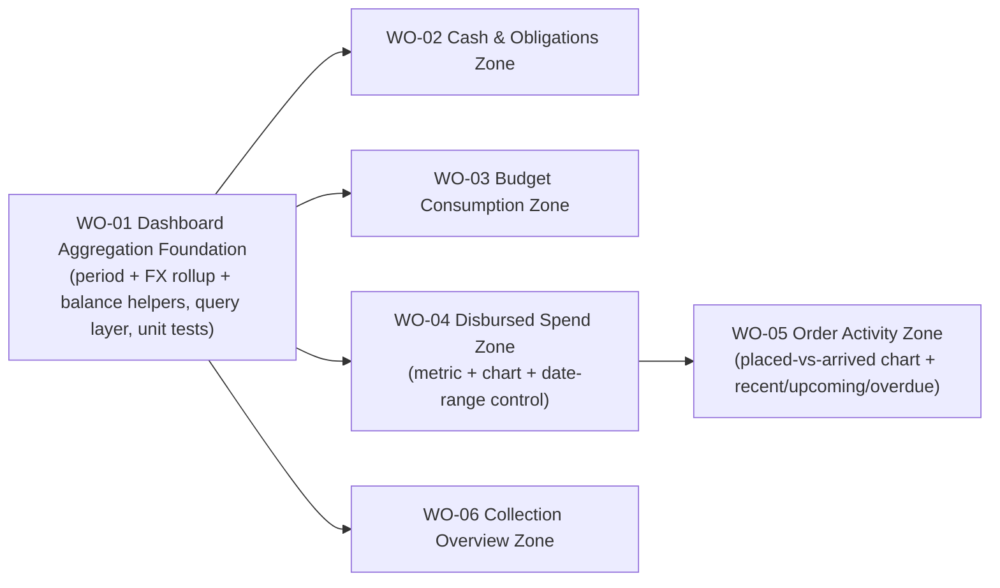

# BP-01 Dashboard Aggregation and Surface

## Purpose

Define how the read-only collector dashboard is built: one shared aggregation/data layer that turns order, payment, and delivery data into base-currency, period-aware metrics, plus a set of vertical UI zones that render those metrics. One blueprint covers the full dashboard vertical for the collector app. The dashboard owns no domain mutations; it reads from the order, payment, and delivery domains and links into them.

## Runtime Components

- a dashboard data-access module under `src/lib/data/dashboard/` (queries + aggregation; no mutations)
- shared period helpers: calendar-month boundaries and budget-cycle boundaries (from `User.budgetResetDayOfMonth`), computed in the user's timezone
- shared base-currency rollup helper that converts per-order amounts via stored exchange rate and **excludes** orders that need FX reconciliation, derived through `needsFxReconciliation` (`src/lib/fx/reconciliation.ts`) so the exclusion matches the orders list exactly, returning both the total and an `isPartial` flag + excluded count (`FR-06-13`)
- shared outstanding-balance helper reused from the order domain (`calculatePaymentSummary` / `totalCost − Σ payments`)
- the dashboard route `src/app/[locale]/(app)/dashboard/page.tsx` (Server Component) replacing the current placeholder
- route-level `_components/` for each dashboard zone (cash/obligations, budget, spend, activity, collection)
- a client date-range control that drives the four range-controlled trend charts (gasto por mes, comprometido por mes, deuda viva, hechos vs llegados), placed in the header of one scoped "Gráficos / Tendencias" section
- charting primitives (per `ui-libs-policy.mdc`; hand-rolled or an approved lib): SVG line charts with hover tooltips, donuts (category spend + arrival punctuality), a framed mini bar chart (próximos meses), and segmented/stacked bars (pagado-vs-pendiente, order-status)
- the additional derived surfaces the aggregation layer must feed: pagado-vs-pendiente split (`FR-06-19`), próximos-pagos itemized list (`FR-06-18`), arrival punctuality (`FR-06-17`), product count by type (`FR-06-20`), the deuda-viva trend (`FR-06-21`), and the comprometido-por-mes trend (`FR-06-24`)
- `POSTHOG_EVENTS.DASHBOARD.*` analytics constants in `src/lib/constants.ts`
- `dashboard` locale namespaces in `src/i18n/locales/{es,en}/dashboard.json`

## Architecture Decisions

- The dashboard is one coherent read-only vertical, cut as a single blueprint with a foundation slice (the aggregation layer) followed by vertical UI zones. There is no separate "backend blueprint" and "frontend blueprint".
- All aggregation lives in the dashboard data layer, never in components. Components receive already-computed, base-currency, period-scoped values.
- The aggregation layer reuses existing order/payment/delivery derivations (payment summaries, `OrderItem.deliveryState`) instead of re-deriving balances or states.
- Money stays in minor units through all aggregation; formatting to the base currency happens only at the view edge.
- Period boundaries (calendar month, budget cycle) are computed in the user's timezone to avoid off-by-one bucketing.
- The date-range control is the single interactive boundary; it is scoped to the trend charts only. Current-period metrics (this month, budget cycle) are computed server-side for the fixed active period and never react to the range control (`FR-06-12`).
- Range resolution owns the first-activity clamp (`FR-06-25`, `BR-06-11`): every preset window is trimmed forward to the month of the collector's earliest activity before any series is bucketed, so the clamp is applied once, in the period layer, rather than per chart. Custom ranges bypass it. Only the leading run is trimmed; interior months always survive as zero buckets, which is what keeps the time axis evenly spaced.
- Charts render **1:1**: the SVG `viewBox` tracks the container's measured pixel width so declared type sizes are real, and the charts grid derives its column count from a minimum card width rather than viewport breakpoints (the content column also narrows when the app sidebar expands). Both rules, plus the 12px chart-text floor, the ~2:1 aspect target, density-aware markers/labels, and the trailing-card rule, are system-level and documented in [interface-patterns.md § 16](../../../../design/interface-patterns.md).
- The FX-reconciliation exclusion is centralized in the rollup helper so every money surface behaves identically and the partial-totals warning is driven by one source of truth.
- The dashboard renders on the server in one pass; zones are server components fed by the single aggregation payload, keeping the client bundle to the range control and charts.
- Every zone has a coherent empty / first-run state (`FR-06-22`): with no data it shows a calm empty or configure state with first-action CTAs, never blank widgets or fabricated data. The full layout, states, responsive/mobile behavior, and the adaptive puntualidad donut are documented in the FDD.

## Contracts

- aggregation contract
  - input: `userId`, `baseCurrencyCode`, `timezone`, `budgetAmount`, `budgetResetDayOfMonth`, and the selected chart range
  - output: a single `DashboardData` object grouping the cash/obligations block, the budget block, the spend block (current-month total + monthly series), the committed-trend block (`Σ totalCost` by `orderDate` month, `FR-06-24`), the outstanding-trend block, the activity block (recent / upcoming / overdue), and the collection block (totals, status distribution, by-type, top stores)
  - every money field is base-currency minor units and carries the `isPartial` / excluded-count context where `FR-06-13` applies
- base-currency rollup contract
  - input: a set of orders (or payments) with their `currencyCode`, `exchangeRate`, `exchangeRateBaseCode`, plus the collector's base currency
  - output: `{ totalMinor, isPartial, excludedOrderCount }` — orders that `needsFxReconciliation` reports as pending are excluded from `totalMinor` and surfaced via `isPartial`
- period contract
  - `getCalendarMonthRange(now, timezone)` and `getBudgetCycleRange(now, timezone, resetDay)` return `{ start, end }` half-open intervals
  - `resolveDashboardRange(selection, now, timezone, earliestActivity)` turns the collector's selection into a whole-month half-open window, applying the first-activity clamp to every preset and leaving a custom range untouched (`FR-06-25`)
- obligations contract
  - "a pagar este mes" = Σ outstanding of orders with `expectedDeliveryFrom` in the current month + Σ outstanding of overdue orders; orders without `expectedDeliveryFrom` excluded and returned separately as the "sin fecha" figure (`BR-06-02`)
- read-only contract
  - the dashboard exposes no server actions; all interactivity is navigation or the chart range control

## Operational Priorities

- correctness of money math (outstanding balance, disbursed totals, budget cycle) above everything
- one centralized FX-reconciliation exclusion with a single partial-totals signal
- timezone-correct period boundaries
- server-first rendering with a minimal client surface
- visual and token parity with the existing collector workspace (orders, deliveries, stores)
- analytics on the meaningful dashboard interactions (range changes, CTA clicks)

## Dependencies

- order, payment, and outstanding-balance logic from [`FRD-05`](../../frd-05-order-payment-shipment/frd-05-order-payment-shipment.md)
- FX-reconciliation derivation and flow from [`FRD-05 · BP-02 · WO-07`](../../frd-05-order-payment-shipment/bp-02-order-workspace-and-list-experience/work-orders/wo-07-currency-reconciliation-filter-and-bulk-fx-reconciliation.md)
- persisted `OrderItem.deliveryState` from [`FRD-08`](../../frd-08-delivery-management/frd-08-delivery-management.md)
- base currency, `budgetAmount`, `budgetResetDayOfMonth`, and `timezone` from [`FRD-07`](../../frd-07-user-settings/frd-07-user-settings.md)
- the private app shell and dashboard route slot from [`FRD-03`](../../frd-03-collector-app-shell/frd-03-collector-app-shell.md)

## Risks

- money correctness: outstanding balance, budget-cycle windows, and timezone bucketing are the highest-risk logic; they must be unit-tested in the foundation slice before any UI consumes them
- inconsistent FX handling if the exclusion is duplicated per zone instead of centralized in the rollup helper
- the date-range control accidentally driving fixed current-period metrics if the server/client boundary is not respected
- chart performance and bundle size if a heavy charting dependency is introduced (see `ui-libs-policy.mdc`)
- dashboard query cost if each zone issues its own broad scan instead of sharing one aggregation pass

## Extension Points

- a future Reminders & Notifications FRD will consume the same obligation/overdue/arrival signals to drive alerts
- delivery-cost spend series, saved dashboard filters, and per-store/per-type drill-down views
- export or share of dashboard summaries

## Implementation Plan

- `WO-01` is the foundation slice: the dashboard data-access module, the shared period helpers, the centralized base-currency FX-exclusion rollup, and the outstanding-balance aggregation, all unit-tested. No UI, no routes. It is the only slice exempt from the "must include an E2E acceptance path" rule because by design it ships no UI.
- After `WO-01`, four zones unlock in parallel: `WO-02` (cash & obligations), `WO-03` (budget), `WO-04` (disbursed spend), and `WO-06` (collection overview). They can be implemented concurrently.
- `WO-05` (order activity) depends on `WO-04` because it reuses the client date-range control that `WO-04` introduces for the trend charts.
- The first zone slice to land replaces the placeholder page shell; subsequent zones compose into the same dashboard route.

Plain-text sequencing: WO-01 first → then WO-02, WO-03, WO-04, WO-06 in parallel → WO-05 after WO-04.

## Linked Work Orders

- `work-orders/wo-01-dashboard-aggregation-foundation.md`
- `work-orders/wo-02-cash-and-obligations-zone.md`
- `work-orders/wo-03-budget-consumption-zone.md`
- `work-orders/wo-04-disbursed-spend-zone.md`
- `work-orders/wo-05-order-activity-zone.md`
- `work-orders/wo-06-collection-overview-zone.md`
