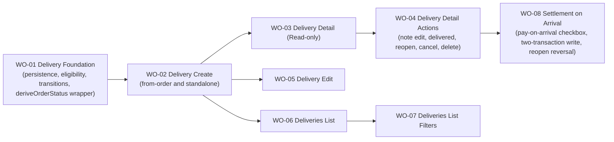

# BP-01 Delivery Management

## Purpose

Define the end-to-end delivery experience: persistence, eligibility, product-state transitions, create/edit flows, detail view, detail actions, list, and filtering. One single blueprint covers the full vertical of the delivery domain for the collector app.

## Runtime Components

- Prisma models for deliveries and delivery-linked product state
- delivery query and mutation modules under `src/lib/data/deliveries/`
- shared eligibility query (products by store, excluding ineligible)
- shared product-state transition helpers (arrived-at-store, in-transit, delivered)
- `deriveOrderStatus` integration wrapper (calls the pure function from [`FRD-05 · BP-01 · WO-02`](../../frd-05-order-payment-shipment/bp-01-order-domain-foundation/work-orders/wo-02-order-item-model-totals-fx-and-derived-order-state-rules.md) within the same transaction as any delivery mutation)
- delivery routes under `src/app/[locale]/(app)/deliveries`
- delivery detail route and route-level components
- delivery create and edit routes (single form, mode-aware)
- expandable delivery cards in the list
- filter sidebar patterned after `Stores`
- inline private-note component patterned after order and store notes
- `StorePayment.settledByDeliveryId` (nullable, `onDelete: Restrict`): the provenance link from a settlement payment back to the delivery that created it (`WO-08`, implemented 2026-08-20, uncommitted, staging). The model itself, and the `createStorePayment` writer this slice calls into, belong to [`FRD-05 · BP-01`](../../frd-05-order-payment-shipment/bp-01-order-domain-foundation/bp-01-order-domain-foundation.md); this blueprint only owns the column's provenance semantics and the delivery-side settlement resolver that decides what to write

## Architecture Decisions

- The delivery domain is one coherent vertical, cut as a single blueprint with a thin foundation slice followed by vertical user-facing slices. There is no separate "backend blueprint" and "frontend blueprint".
- Delivery operates on order products, not whole orders, because partial grouping across orders is fundamental to the domain.
- Eligibility is query-driven: ineligible products never appear in the selector instead of being shown as disabled options.
- Product delivery state is recalculated from delivery actions. There are no manual repair steps.
- Cancel and delete stay separate: cancel preserves the delivery with `CANCELLED`, delete removes the record entirely where delete rules allow it.
- Reopen is explicit so delivered deliveries can be corrected without inventing a second "edit after delivered" mode.
- Reopen is also the primary visible recovery action for cancelled deliveries, so the collector can return the record to an editable state before making further corrections.
- Delivery detail uses grouped source-order sections, one private note section, and no automatic history timeline in MVP, for visual and interaction parity with orders.
- Source-order grouping in delivery detail exists for traceability of product origin, but the delivery remains the primary visual subject of the page.
- Product-name search remains a list-filter concern rather than a separate top-level search surface.
- The deliveries list opens in an active-deliveries default state: when no filter params are present, the route canonicalizes to an explicit `status=IN_TRANSIT` query, the sidebar shows that status selected, and the chip row reflects the same visible default.
- Deliveries list filtering uses two distinct date concepts instead of one combined date control: shipping date (`Delivery.deliveryDate`) uses a manual range, while `expectedArrival` supports both a manual range and collector-oriented presets (`Overdue`, `Due today`, `Next 7 days`, `Next 14 days`, `This month`).
- Expected-arrival presets and manual expected-arrival ranges are mutually exclusive within the same filter block. Choosing a preset updates the visible calendar range; manually editing that range clears the preset.
- Expected-arrival manual range filtering uses interval-overlap semantics: a delivery matches when any portion of its expected-arrival range overlaps the user-selected filter range.
- The deliveries detail back link should reuse the same `?returnTo=` pattern already established by orders so the collector can return from detail to the same filtered deliveries list state.
- Every delivery mutation that changes product-to-delivery associations (create, edit, mark delivered, reopen, cancel, delete) must call `deriveOrderStatus` for every affected order and persist the result within the same transaction.
- The detail-action hierarchy should reuse the existing order-detail split secondary pattern: a labeled secondary action plus an adjacent overflow trigger for additional actions.
- Delivery private notes follow the same inline-note rule as orders and stores: saving an empty trimmed value clears the stored note.
- Delete is discoverable but state-gated: a `DELIVERED` delivery keeps the `Delete` affordance visible, but the action is blocked with explanatory feedback until the collector reopens the delivery. Physical delete always requires a confirmation modal and returns to the deliveries list on success.
- `Delivery.deliveryDate` is presented to collectors as the shipping date. The actual received date is captured by the mark-delivered flow and is required when moving a delivery to `DELIVERED`.
- **Settlement on arrival is two transactions, not one (`ADR 0032`).** The delivery-closing write and the store-payment write it can trigger are split into a delivery transaction followed by an independent **money transaction**, instead of one transaction covering both. **(revised 2026-08-20, round-4 arbitration):** "the delivery-closing write" is whichever of the two order-closing mutations actually ran, `createDelivery` (born `DELIVERED` when `receivedDate` is set, the five approved checkbox launchers) or `markDeliveryDelivered` (the formal flow's "mark delivered" action), not only the latter as an earlier draft of this document said; `WO-08`'s own text had named only `markDeliveryDelivered`, but the five approved launchers verifiably call `createDelivery` instead. "The delivery never blocks" and "the payment write is Serializable with retry" cannot both hold inside a single transaction: a serialization conflict on the payment side is only detectable at commit, and refusing there would be exactly the late rejection `ADR 0022` forbids on a write the collector already believes succeeded. Splitting the writes means the delivery always commits first and unconditionally; a failed money transaction leaves the delivery correctly `DELIVERED` with a retryable pending payment instead of rolling back a fact that already happened. See `WO-08`.
- **The money transaction consumes before it settles, and it is not gated by the checkbox, nor by which mutation closed the order (`FR-08-46`, `ADR 0033`).** For every order the delivery transaction just closed to `COMPLETED`, the money transaction first calls `FRD-05 · BP-01 · WO-09`'s `consumeUnassignedStoreMoneyOnOrderClose` against that order, and only afterward computes and, if the collector left "Ya pagué el resto" checked, writes this slice's own settlement (`FR-08-40`) from the order's now-current `openBalanceMinor` (`FRD-05 · BR-05-32`, `ADR 0034`: `totalCost` net of both its allocations and its reconciliation adjustment lines). Consuming first is what keeps the settlement amount from overstating what the order still owes; the two steps are not interchangeable. The consumption half runs whenever an order closes with unassigned money to consume, independent of the checkbox: unchecking it only skips the settlement half of the same transaction. **It also runs behind `markDeliveryDelivered`** (the formal flow's "mark delivered" action), even though that flow renders no settlement checkbox at all: the consumption is a general order-close invariant (`FR-08-46`), not a feature of the checkbox UI, so this is the one place `WO-08` reaches into the formal flow's own Server Action (`deliveryLifecycleActions.ts`), without adding any UI there. `editDelivery` is not a third producer: it is restricted to `IN_TRANSIT` deliveries and its own transitions never write `DELIVERED`, so it can never itself close an order (verified against `src/lib/data/deliveries/deliveryMutations.ts` and `FR-08-24`/`BR-08-07`). Folding the consumption into the delivery transaction instead (an earlier draft's shape) would put a money write behind the same commit as the fulfillment change it must never gate on, contradicting both `FR-05-33`'s "no money change in the same commit as a fulfillment change" and this ADR's own single-writer-per-commit reasoning. See `WO-08`.
- **An order whose `openBalanceMinor` a store reconciliation has already driven to `0` offers nothing to settle (`ADR 0034`).** The settlement checkbox does not render for such an order: rendering it pre-marked would re-offer a debt the collector no longer owes, entering an already-forgiven balance as fresh disbursed spend the moment the order finally arrives. This is a direct consequence of switching the settlement amount from a gross balance to the canonical `openBalanceMinor`, not a separate rule.
- **Reopen reverts the settlement, never the order-close consumption (`FR-08-43`, `FR-08-46`).** The two write to different `StorePayment` rows: the settlement's own row carries this delivery's `settledByDeliveryId` and is what reopen deletes; the consumption writes onto an unrelated, pre-existing `StorePayment` that predates this delivery and carries no such reference, so reopen's delete-by-`settledByDeliveryId` query cannot reach it and must not be widened to try. The money the consumption moved was already paid to the store before this delivery existed and still belongs to the reopened order, which still owes the rest; reverting it would manufacture debt. The reopen-reversion copy names both amounts, distinguished, whenever both apply.
- **`Retry` is preconditioned on the delivery still being `DELIVERED` (`FR-08-42`).** A reopen that happens between a failed money-transaction attempt and a subsequent `Retry` returns the delivery to `IN_TRANSIT`; `Retry` re-checks this fresh, immediately before opening the money transaction, rather than trusting whatever state rendered the button. Retrying anyway would write a settlement `StorePayment` whose `settledByDeliveryId` points at a delivery no longer `DELIVERED`, an orphan nothing in the product deletes and one the settlement column's `onDelete: Restrict` FK then blocks from being cleaned up even by deleting that delivery.

## Contracts

- eligibility contract
  - input: store id, (optional) source order id for preselection
  - output: eligible products grouped by source order, excluding products that are already delivered or already attached to another active delivery
- create/edit contract
  - input: store, shipping date, expected arrival range, cost, currency, optional FX, selected product ids
  - invariant: both create and edit require at least one selected product at save time; a delivery with zero linked products is invalid and must not be persisted
  - output: persisted delivery, recalculated product states, and re-derived `OrderStatus` for every affected order
  - edit-specific guard: if the delivery is no longer in an editable lifecycle state, edit must redirect back to detail with feedback telling the collector to reopen first
  - product-selector search: an in-section product-name search input filters the already-loaded eligible products in place. Matching is case- and accent-insensitive, source-order groups with no matches are hidden, and a no-results empty state replaces the product list when nothing matches the current query. Filtering is entirely client-side and never refetches eligible products. The query resets when the collector switches stores.
- lifecycle contract
  - input: `markDelivered` with required received date, `reopen`, `cancel`, `delete`, `updatePrivateNote`, and `updateProductMembership` (from edit)
  - output: updated delivery state, updated product states, and re-derived `OrderStatus` for every affected order
  - mark-delivered guard: received date is required, must be past or current, and is persisted with the delivered state
  - lifecycle state guards: `markDelivered` and `cancel` require `IN_TRANSIT`; `delete` rejects `DELIVERED`; `reopen` requires a non-`IN_TRANSIT` source and clears the received date as it returns the delivery to `IN_TRANSIT`
  - reopen reassignment guard: reopening a `CANCELLED` delivery is rejected when any of its products now belongs to another active (non-cancelled) delivery, preserving the one-delivery-per-product rule (`BR-08-08`)
  - error contract: every mutation returns a typed expected-error union rather than throwing — create/edit can return `STORE_NOT_FOUND`, `NO_PRODUCTS_SELECTED`, `PRODUCTS_FROM_DIFFERENT_STORE`, `PRODUCT_NOT_ELIGIBLE` (with offending product ids), `EXCHANGE_RATE_REQUIRED`, and `INVALID_STATUS` (edit only); lifecycle/note mutations can return `DELIVERY_NOT_FOUND`, `INVALID_STATUS`, and (reopen) `PRODUCTS_IN_OTHER_DELIVERY`. Concurrent product-state changes are reconciled into `PRODUCT_NOT_ELIGIBLE`. Only unexpected failures are captured in monitoring.
- settlement contract (`WO-08`, implemented 2026-08-20, uncommitted, staging)
  - input: the mark-delivered checkbox state ("Ya pagué el resto", pre-marked by default unless the unassigned-money guard below applies), an editable settlement date defaulted to the received date, and an optional collector-entered amount
  - output: at most one `StorePayment` per order the delivery completed or partially completed, each carrying `settledByDeliveryId`, written by the money transaction described above, independent of the delivery write
  - order-close consumption: for every order this delivery closes to `COMPLETED`, the money transaction first calls `FRD-05 · BP-01 · WO-09`'s `consumeUnassignedStoreMoneyOnOrderClose` against that order, unconditionally, before computing this contract's own settlement amount (`FR-08-46`); this runs even when the checkbox is unchecked, since only the settlement half is gated by it. **(revised 2026-08-20, round-4 arbitration):** it runs regardless of which of the two order-closing mutations closed the order (`createDelivery` with `receivedDate` set, or `markDeliveryDelivered`), so it also fires behind the formal flow's "mark delivered" action even though that flow renders no checkbox at all
  - amount resolution: full-order branch always computes the order's `openBalanceMinor` (`FRD-05 · BR-05-32`, `ADR 0034`), read **after** the order-close consumption above has applied; partial branch only auto-computes when every delivered item is priced and the order carries no undetailed allocation, capped at `min(computed sum, openBalanceMinor(order))` (revised 2026-08-20, round-4 arbitration: the per-item formula cannot see a `StoreAccountAdjustmentLine`, which is written per order, so an uncapped sum could exceed the order's real balance; when the cap actually bites, the write drops to one undetailed allocation rather than a per-item split scaled down to fit, per `BR-08-16`); otherwise the amount is collector-entered with the same ceiling. When `openBalanceMinor` is already `0` (a store reconciliation wrote off the whole balance), the checkbox does not render for that order at all
  - provenance guard: a collector-entered or collector-corrected amount is written as one undetailed allocation, never as the app's own computed per-product split, because only a split the app itself derived may be presented as attributed
  - unassigned-money guard: **(revised 2026-08-20, round-4 arbitration, two branches by whether this arrival closes the order)** when the arrival closes the order, the consumption above already folds any unassigned money into `openBalanceMinor` before the checkbox's default is decided, so the checkbox pre-marks normally and the guard's copy is informative only; when it does not close the order, no consumption runs, and the guard behaves as originally specified: the checkbox opens unmarked, instead of pre-marked, when the order's store already holds unassigned money in the settlement currency
  - failure contract: a money-transaction failure (either half) after the delivery already committed leaves the delivery correctly `DELIVERED` and exposes a `Retry` action that recomputes the whole money transaction from current state, never from a client-held figure. `Retry` is preconditioned on the delivery still reading `DELIVERED`, re-checked fresh at the moment it runs; a reopen in the interim makes `Retry` a refusal, not a write, so no settlement `StorePayment` is ever created against a delivery that is no longer `DELIVERED`
  - reversal: `reopen` deletes every `StorePayment` whose `settledByDeliveryId` is that delivery and reports the reverted amount; the reopen's own "Deshacer" restores that exact deleted snapshot instead of recomputing a new settlement. Reversal never reaches the order-close consumption above: that money was applied to the order before this delivery existed and stays applied after reopen, so the reopen-reversion copy names both amounts, distinguished, whenever both applied on close
- detail action chrome contract
  - `IN_TRANSIT`: primary `Mark delivered`, visible `Edit`, overflow `Cancel` and `Delete`
  - `DELIVERED`: primary `Reopen`; additional actions remain in the secondary / overflow affordances
  - `CANCELLED`: primary `Reopen`, overflow `Delete`
  - `Delete` remains visible in `DELIVERED` but is disabled until the collector reopens the delivery
- detail read contract
  - input: delivery id
  - output: delivery summary, grouped products by source order, current lifecycle state, action availability flags, received date when delivered, and the private note value
  - grouped source-order sections are expanded by default in the read-only detail view
- deliveries list contract
  - route: `/{locale}/deliveries`
  - visible primary action: `New delivery`, following the same collector-listing hero pattern used by orders and stores
  - output: paginated delivery cards sorted from oldest date to newest by default (`DELIVERY_LIST_PAGE_SIZE` = `DEFAULT_PAGE_SIZE` = 25 per page by default, user-selectable among 10/25/50/100 — `PAGE_SIZE_OPTIONS` — via `?perPage=`. **Updated 2026-07-23, owner-approved:** replaces the earlier fixed 30/page; see [ADR 0018](../../../../design/decisions/0018-list-pagination-page-size-and-desktop-summary.md))
  - each card shows store, shipping date, expected arrival range, and status; delivered cards also show received date
  - card expansion renders a flat product list only; it does not group by source order and does not show source-order secondary metadata in this slice
  - sort: a `sort` param selects one of `oldest` (default), `recent`, `eta-asc`, `store-asc`; it is omitted from the URL when it equals the default (`FR-08-35`)
- list filter contract
  - input: status, one store, product-name text, shipping-date range, `expectedArrival` manual range or `OVERDUE` toggle
  - output: URL-canonical filter state and removable chips patterned after `Stores`
  - URL params (actual): `q` (free text over delivery id + product name), `status` (repeatable), `store`, `product` (product-name-only text), `overdue` (boolean), `arrivalFrom` / `arrivalTo`, `shippedFrom` / `shippedTo`, `sort`, `page`
  - default state: `status=IN_TRANSIT` is applied and materialized in the URL when no filter params are present; an explicit empty `status=` means "all statuses" and is preserved
  - product-name query matches any included product by substring, case-insensitive and accent-insensitive
  - expected-arrival manual range matches by interval overlap rather than full containment
  - expected-arrival presets (`Due today`, `Next 7 days`, `Next 14 days`, `This month`) only populate the manual `arrivalFrom` / `arrivalTo` range and do not persist as their own param; they are mutually exclusive with a manually edited range
  - the `OVERDUE` shortcut is the one expected-arrival preset that persists (as the `overdue` boolean param). It is an active-follow-up shortcut (IN_TRANSIT deliveries past their expected-arrival end) and keeps the visible status-filter state aligned to active deliveries

## Operational Priorities

- strict one-store boundary per delivery
- minimum-one-product invariant for every persisted delivery
- safe and centralized product-state recalculation
- predictable eligibility
- easy correction flows (edit and reopen)
- visual parity with orders
- filter persistence through the URL
- canonical collector route naming under `/deliveries`

## Dependencies

- order-product model from [`FRD-05`](../../frd-05-order-payment-shipment/frd-05-order-payment-shipment.md)
- `deriveOrderStatus` pure function from [`FRD-05 · BP-01 · WO-02`](../../frd-05-order-payment-shipment/bp-01-order-domain-foundation/work-orders/wo-02-order-item-model-totals-fx-and-derived-order-state-rules.md) — must be called and the result persisted within every delivery mutation that changes product delivery associations
- `createStorePayment` and the `StorePayment` / `PaymentAllocation` models from [`FRD-05 · BP-01`](../../frd-05-order-payment-shipment/bp-01-order-domain-foundation/bp-01-order-domain-foundation.md) — the settlement step (`WO-08`, implemented 2026-08-20, uncommitted, staging) writes through this existing store-level-payment path rather than introducing a second payment writer
- `getUnassignedStoreMoneyMinor` and `consumeUnassignedStoreMoneyOnOrderClose` from [`FRD-05 · BP-01 · WO-09`](../../frd-05-order-payment-shipment/bp-01-order-domain-foundation/work-orders/wo-09-store-payment-assignment-and-open-order-debt.md) — a **hard ordering dependency**, not merely a dependency on the store-level payment writer in general: `WO-09` must land before `WO-08` starts, because `WO-08`'s money transaction calls both as already-defined canonical helpers (`FR-08-46`) rather than deriving either a second time
- the canonical `openBalanceMinor(order)` helper and the `StoreAccountAdjustmentLine` model from [`FRD-05 · BP-01 · WO-10`](../../frd-05-order-payment-shipment/bp-01-order-domain-foundation/work-orders/wo-10-order-open-balance-and-store-account-adjustment-model.md) (`FRD-05 · BR-05-32`, `ADR 0034`) — also a **hard ordering dependency**: `WO-08`'s settlement resolver and its reused `EXCEEDS_BALANCE` ceiling both read this helper rather than the older, adjustment-blind `totalCost - allocatedAmountMinor`, so an order that has ever been through a store reconciliation can only be settled correctly once `WO-10` exists. **(revised 2026-08-20, round-4 arbitration):** `WO-10` was split into two work orders; the sole owner of `openBalanceMinor` and `StoreAccountAdjustmentLine` is now the narrower `WO-10` linked above (_Order open balance and store account adjustment model_), while the reconciliation write action itself (the former `WO-10`'s "cuadrar cuenta" flow) moved to a new `FRD-05 · BP-01 · WO-11` (_Store account reconciliation action_), which this blueprint does not depend on directly. The single declaration of the canonical build order across both blueprints — `WO-01 → WO-02 → WO-03 → WO-10 → WO-09 → WO-11 → {WO-08, WO-07}` — lives in `FRD-05 · BP-01`'s own implementation plan; this bullet only cites it rather than restating it
- user base-currency preference from [`FRD-07`](../../frd-07-user-settings/frd-07-user-settings.md)
- private app route shell from [`FRD-03`](../../frd-03-collector-app-shell/frd-03-collector-app-shell.md)

## Risks

- reopen and edit flows can create inconsistent product states if the recalculation logic is not centralized in shared helpers consumed by every mutation
- stale edit submissions can create hidden partial saves if eligibility and lifecycle status are not revalidated atomically at save time
- eligibility queries can become expensive if grouped order-product loading is not shaped carefully
- delete and cancel semantics can confuse users if the state rollback is not visible enough in the UI
- grouped product cards can become visually noisy if order identifiers and eligibility signals are not compact
- reopening delivered deliveries can create misleading UI if action affordances do not reflect the new editable state immediately
- re-implementing the split secondary plus overflow pattern separately in each detail screen would create inconsistent action hierarchy and duplicate accessibility work
- a settlement payment and an unassigned-money guard that both react to the same underlying figure can double-count if the guard's read and the settlement write are not against the same fresh state (`WO-08`)
- a collector's own delivery history has not yet produced an order whose payment breakdown mixes an app-computed allocation with a pre-existing undetailed one; the first real occurrence of that shape is a rendering risk with no prior fixture to catch it against (`WO-08`)

## Extension Points

- future carrier integrations
- future delivery-cost analytics
- future delivery milestones beyond `IN_TRANSIT` and `DELIVERED`
- future dashboard deep links and saved filtered views
- future delivery history timeline if collector demand justifies it

## Implementation Plan

- `WO-01` is the foundation slice: Prisma schema, enums, Zod schemas, eligibility helpers, product-state transition helpers, and the `deriveOrderStatus` integration wrapper. No UI, no routes. It is the only slice exempt from the "must include an E2E acceptance path" rule because by design it ships no UI; it is validated with unit tests.
- `WO-02` Delivery Create must happen immediately after `WO-01` because every downstream slice assumes delivery records can exist.
- After `WO-02`, three slices unlock in parallel: `WO-03` (detail read-only), `WO-05` (edit), and `WO-06` (list). They can be implemented concurrently.
- `WO-04` (detail actions) depends on `WO-03` because it operates from the detail view surface.
- `WO-07` (filters) depends on `WO-06` (list).
- `WO-08` (settlement on arrival) depends on `WO-04` because it extends `reopenDelivery` and `markDeliveryDelivered` (both already owned by that slice), rather than introducing a parallel lifecycle path. **(revised 2026-08-20, round-4 arbitration):** `WO-08` also extends `createDelivery`, owned by `WO-02` (Delivery Create), since the five approved checkbox launchers close orders through `createDelivery` with `receivedDate` set, not through `markDeliveryDelivered`; an earlier draft of this dependency line named only the latter. It also depends on the store-level payment writer from `FRD-05 · BP-01`, external to this blueprint's own dependency chain. **`FRD-05 · BP-01 · WO-09` must land before `WO-08` starts, as a hard order, not merely as a dependency on the payment writer in general:** `WO-08`'s money transaction calls `WO-09`'s `getUnassignedStoreMoneyMinor` and `consumeUnassignedStoreMoneyOnOrderClose` as already-defined canonical helpers (`FR-08-46`), so implementing `WO-08` first would leave its own order-close consumption with nothing to call. **`FRD-05 · BP-01 · WO-10` is the same kind of hard order:** `WO-08`'s settlement amount and its reused `EXCEEDS_BALANCE` ceiling both read `WO-10`'s canonical `openBalanceMinor(order)` (`FRD-05 · BR-05-32`, `ADR 0034`), so implementing `WO-08` before `WO-10` exists would leave it computing a gross balance blind to reconciliation adjustment lines, exactly the defect `ADR 0034` was written to close. **(added 2026-08-20, round-4 arbitration):** the canonical build order across both blueprints, `WO-01 → WO-02 → WO-03 → WO-10 → WO-09 → WO-11 → {WO-08, WO-07}` (declared once in `FRD-05 · BP-01`'s own implementation plan, cited here), places the new `FRD-05 · BP-01 · WO-11` (the reconciliation action split out of the former `WO-10`) immediately ahead of `WO-08` too, even though `WO-08` calls nothing `WO-11` defines directly; work-order numbers are identifiers, not an execution order.

## Linked Work Orders

- `work-orders/wo-01-delivery-foundation.md`
- `work-orders/wo-02-delivery-create.md`
- `work-orders/wo-03-delivery-detail-read-only.md`
- `work-orders/wo-04-delivery-detail-actions.md`
- `work-orders/wo-05-delivery-edit.md`
- `work-orders/wo-06-deliveries-list.md`
- `work-orders/wo-07-deliveries-list-filters.md`
- `work-orders/wo-08-settlement-on-arrival.md`
