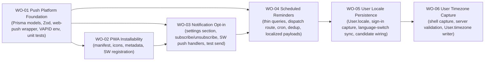

# BP-01 PWA and Push Reminders Platform

## Purpose

Define the single technical platform behind [`FRD-09`](../frd-09-reminders-and-notifications.md): making the collector app an installable PWA, holding push subscriptions and per-type preferences, and running a scheduled, timezone-aware, deduplicated dispatcher that sends localized, deep-linked Web Push reminders for upcoming payments, upcoming arrivals, and overdue arrivals. One blueprint covers the full vertical from persistence to service worker to cron.

## Runtime Components

- Prisma models `PushSubscription` and `NotificationDelivery` (send-dedup log), plus the per-type preference store (decided below).
- notification data-access modules under `src/lib/data/notifications/` (`notificationQueries.ts`, `notificationMutations.ts`), singleton import per [ADR 0015](../../../../design/decisions/0015-data-access-layer-shape.md).
- thin due-soon / overdue candidate queries used only by the dispatcher (not the dashboard aggregation).
- a `web-push` wrapper under `src/lib/push/` that signs and sends a payload to one subscription and classifies the result (sent, expired, transient failure).
- shared Zod schemas for the browser subscription payload and the preference mutations.
- web app manifest metadata route `src/app/manifest.ts` and PWA icon assets under `public/`.
- hand-rolled service worker `public/sw.js` handling `push` and `notificationclick`.
- a client service-worker registration module invoked from the authenticated app shell.
- a Notifications section inside the existing settings page, with subscribe / unsubscribe / set-preference / send-test server actions.
- dispatch route handler `src/app/api/notifications/dispatch/route.ts` guarded by `CRON_SECRET`.
- `vercel.json` cron entry driving the dispatcher daily.
- a new next-intl `notifications` message namespace resolved server-side at dispatch time.

## Architecture Decisions

- The reminder platform is one coherent vertical, cut as a thin foundation slice (persistence, wrapper, env, schemas) followed by three user-facing / operational slices (installability, opt-in, scheduled dispatch). There is no separate backend versus frontend blueprint.
- The service worker is hand-rolled plain JavaScript at `public/sw.js`. No `workbox`, `serwist`, or `next-pwa`. This follows the hand-roll-by-default posture and the UI-primitive libraries policy spirit ([ADR 0010](../../../../design/decisions/0010-ui-primitive-libraries-policy.md)). A dedicated ADR for this web-push platform decision should be authored during implementation (next available ADR number); this blueprint is its design input, not the ADR itself.
- The manifest is delivered by the Next.js metadata route rather than a static file, so theme and background colors read from the design tokens and stay theme-consistent.
- Push transport is the `web-push` package with VAPID keys from environment variables (`NEXT_PUBLIC_VAPID_PUBLIC_KEY`, `VAPID_PRIVATE_KEY`, `VAPID_SUBJECT`). The public key is client-exposed by design; the private key never leaves the server.
- **Per-type preference storage decision:** per-type preferences live on a dedicated `NotificationPreference` model keyed by `userId` (one row per collector, one boolean column per reminder type), not on `PushSubscription` and not on `User`. Rationale: preferences are a property of the _collector_, not of a single browser/endpoint (a collector can have several subscriptions across devices, and all must honor one consistent preference set), so storing them on `PushSubscription` would duplicate and risk divergence. Keeping them off the wide `User` row avoids growing an already-large auth model with feature columns and keeps the notifications domain self-contained under `src/lib/data/notifications/`. The master on/off is _derived_ (the collector has at least one `ACTIVE` subscription), not a stored flag, so the browser subscription state stays the single source of truth for "can we reach this collector at all".
- The dispatcher uses thin dedicated queries. It reuses the _definitions_ of upcoming payment / upcoming arrival / overdue arrival from the dashboard aggregation ([`FRD-06`](../../frd-06-dashboard/frd-06-dashboard.md)) and the delivery overdue notion from [`FRD-08`](../../frd-08-delivery-management/frd-08-delivery-management.md), but never calls `getDashboardData`. A batch job must not pay for a full per-collector dashboard build.
- Windowing is timezone-aware from `User.timezone` with a `UTC` fallback, reusing the same principle the settings domain already applies to budget cycles ([`FRD-07 · FR-07-34`](../../frd-07-user-settings/frd-07-user-settings.md#functional-requirements)).
- Deduplication is enforced by a persisted `NotificationDelivery` row per (`userId`, `type`, subject id, due date). The dispatcher is therefore idempotent across same-day re-runs and safe to retry.
- Expired-subscription pruning is part of the send path, not a separate cleanup job: a `410`/`404` result immediately removes the offending subscription and the batch continues.
- Notification copy is resolved server-side with `getTranslations` against the collector's stored locale. Client React hooks are never on the dispatch path.
- Service-worker registration is idempotent and fails closed: a registration error is captured but never blocks the app shell from rendering.

## Contracts

- browser subscription contract
  - input: the `PushSubscription` JSON from the browser (`endpoint`, `keys.p256dh`, `keys.auth`) plus optional `userAgent`.
  - validation: Zod at the server-action boundary; malformed input returns `SUBSCRIPTION_INVALID`.
  - output: a persisted `PushSubscription` row upserted by `endpoint` (`FR-09-10`), owned by the session user.
- preference contract
  - input: reminder `type` (`PAYMENT_DUE`, `ARRIVAL_DUE`, `ARRIVAL_OVERDUE`) and a boolean.
  - output: the collector's `NotificationPreference` row updated for that type; unspecified types keep their stored value.
- dispatch candidate contract
  - input: `now`, resolved per collector into their timezone window.
  - output (thin queries): for each type, the minimal set of (collector, subject id, due date, deep-link target, order/delivery currency-free descriptor) needed to compose and dedup a reminder. No money rollups, no FX, no full order graph.
- send contract (`src/lib/push/`)
  - input: one subscription plus a serialized payload (title, body, deep-link URL, tag).
  - output: a typed result union: `SENT`, `EXPIRED` (`410`/`404` → prune), or `TRANSIENT_FAILURE` (logged with delivery-safe context, batch continues).
  - the payload never carries money values, note text, or subscriber keys beyond what the transport requires.
- dispatch route contract
  - guard: `CRON_SECRET` bearer; `401` before any query or send (`FR-09-20`).
  - behavior: for each candidate, skip when the type preference is off or no active subscription exists (`BR-09-01`), skip when a dedup row already exists (`BR-09-02`), otherwise send to every active subscription, write the dedup row on first successful send, and prune expired endpoints.
  - output: a run summary (attempted / sent / deduped / pruned by type) and a single Sentry capture only on unexpected failure.
- installability contract
  - manifest: `name`, `short_name`, `start_url`, `scope`, `display: standalone`, token-sourced `theme_color` / `background_color`, and the icon set (`192`, `512`, `512` maskable).
  - service worker: registered on authenticated load, idempotent, handling `push` and `notificationclick`.

## Operational Priorities

- opt-in integrity: never send without active subscription plus master plus per-type consent.
- idempotent dispatch: a re-run never double-sends.
- batch resilience: one bad subscription or transient failure never aborts the run.
- least-work batch: thin queries only, no dashboard aggregation.
- secret-guarded entry: no unauthenticated path can trigger sends.
- privacy-safe payloads and logs: no money, notes, or keys leaked.
- timezone correctness: windows computed in the collector's timezone with a `UTC` fallback.
- app-shell safety: PWA registration never breaks the app if it fails.

## Dependencies

- `User.timezone`, `User.locale` context, and the settings surface from [`FRD-07`](../../frd-07-user-settings/frd-07-user-settings.md); the Notifications section extends the existing settings page.
- the domain definitions of due payment, upcoming arrival, and overdue arrival from [`FRD-06 dashboard`](../../frd-06-dashboard/frd-06-dashboard.md) and the delivery overdue notion from [`FRD-08 delivery management`](../../frd-08-delivery-management/frd-08-delivery-management.md); reused as definitions, reimplemented as thin queries.
- order and delivery detail routes from [`FRD-05`](../../frd-05-order-payment-shipment/frd-05-order-payment-shipment.md) and [`FRD-08`](../../frd-08-delivery-management/frd-08-delivery-management.md) as deep-link targets.
- the private app shell from [`FRD-03`](../../frd-03-collector-app-shell/frd-03-collector-app-shell.md) as the service-worker registration host.
- the test platform from [`FRD-02 testing and quality baseline`](../../frd-02-testing-and-quality-baseline/frd-02-testing-and-quality-baseline.md) for unit and E2E coverage of the non-foundation slices.
- new environment variables (`NEXT_PUBLIC_VAPID_PUBLIC_KEY`, `VAPID_PRIVATE_KEY`, `VAPID_SUBJECT`, `CRON_SECRET`) added to `.env.example` per [`env-example.mdc`](../../../../../.agents/rules/env-example.mdc).
- Vercel Cron for the daily schedule.

## Risks

- Web Push behaves differently across browsers and platforms (notably iOS Safari, which requires the app to be installed to the home screen before push works); opt-in UX must set expectations and degrade cleanly.
- Without atomic dedup writes, a crash mid-batch or a same-day re-run could double-send; the `NotificationDelivery` unique key must be enforced at the database level, not only in code.
- A slow or failing single endpoint could stall the batch if sends are not isolated and time-boxed per subscription.
- Leaking money, note text, or subscriber keys into a payload or a log would be a privacy regression; payload shaping and logging must be reviewed.
- Reusing the dashboard aggregation "just to reuse code" would make the batch job expensive and is explicitly rejected; the thin-query boundary must be kept.
- Stale service-worker versions can serve old behavior; the worker must be versioned and update cleanly, and must never cache domain data in MVP (installability only).
- ~~Timezone gaps: because `User.timezone` has no settings UI today, most collectors fall back to `UTC`, which can shift a reminder by up to a day at the edges; acceptable for MVP but noted.~~ **Closed by `WO-06`**: the timezone is captured silently from the authenticated app shell and kept in sync with the collector's browser, so the `UTC` fallback is now the exception (a collector who has not loaded the app since the capture shipped) rather than the default. No settings UI was needed to close it.

## Extension Points

- additional reminder types (for example fully-overdue-payment escalation, budget-threshold nudges).
- collector-configurable lead-time windows and quiet hours.
- an in-app notification center backed by the same dispatch records.
- email or SMS channels layered on the same candidate queries.
- richer offline support (cached reads, background sync) built on the same service worker.
- a collector-facing timezone control in Settings (display and manual override). The automatic capture is closed by `WO-06`; a manual override would additionally require an explicit-choice flag so the shell stops overwriting the collector's own selection.

## Implementation Plan

- `WO-01` is the foundation slice: Prisma models, migration, shared Zod schemas, the `web-push` wrapper, and VAPID env plumbing. It ships no UI and no routes and is validated with unit tests. It is the only slice exempt from the "must include an E2E acceptance path" rule.
- `WO-02` PWA installability depends only on `WO-01` for shared plumbing and can otherwise stand alone: manifest, icons, metadata, and service-worker registration (registration only, no push logic yet).
- `WO-03` notification opt-in depends on `WO-02` because the service worker must already exist and be registered before it can carry `push` / `notificationclick` handlers and before the browser can subscribe.
- `WO-04` scheduled reminders depends on `WO-03` because it needs real subscriptions and preferences to target.
- `WO-05` user locale persistence is a follow-on slice after `WO-04`. It closes the `User.locale` extension point this blueprint names in its own Dependencies and Extension Points: `WO-04` shipped the dispatcher with a nullable `locale` on every candidate, so every reminder is composed in the default locale until a locale is stored. `WO-05` adds `User.locale`, captures the locale the collector browses with at sign-in, keeps it in sync when they switch language, and selects it in the candidate queries. The dispatcher itself does not change.
- `WO-06` user timezone capture is the second follow-on slice, and closes the other half of the context gap `WO-05` opened the door to. `User.timezone` is read by the dispatcher's windowing (and by the dashboard), but no user-facing path ever wrote it, so every collector fell back to `UTC`. `WO-06` captures the browser's IANA zone silently from the authenticated app shell, validates it server-side, and keeps it in sync. Unlike the locale, the timezone cannot be derived server-side at sign-in (only the browser knows it), and mounting the capture in the shell also backfills existing collectors. It ships no migration: the column already exists. The dispatcher, the windowing helpers, and the dashboard are untouched.
- Sequencing is essentially linear (`WO-01` → `WO-02` → `WO-03` → `WO-04` → `WO-05` → `WO-06`). The one safe parallelization: once `WO-01` is merged, the `WO-02` installability assets (manifest, icons, metadata) can be built alongside early `WO-03` settings-UI scaffolding, but `WO-03`'s subscribe path cannot be finished until `WO-02`'s registered worker lands. `WO-05` and `WO-06` are independent of each other and could run in parallel after `WO-04`; they are listed in the order they were executed.

## Linked Work Orders

Implementation order (largely linear; see the one parallelization note above):

- `work-orders/wo-01-push-platform-foundation.md`
- `work-orders/wo-02-pwa-installability.md`
- `work-orders/wo-03-notification-opt-in.md`
- `work-orders/wo-04-scheduled-reminders.md`
- `work-orders/wo-05-user-locale-persistence.md`
- `work-orders/wo-06-user-timezone-capture.md`
