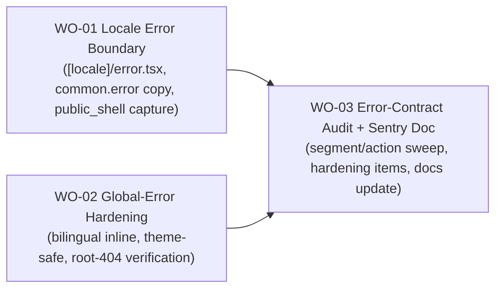

# BP-01 Error Surface Coverage

## Purpose

Define the technical layer that guarantees complete error and 404 coverage across every route segment of the collector app and its public surfaces, hardens the catastrophic global-error fallback, and enforces one consistent error-capture discipline. One blueprint covers the whole hardening vertical because the surfaces share primitives, a capture contract, and a single coverage guarantee.

## Runtime Components

- new locale-level route error boundary: `src/app/[locale]/error.tsx` (Client Component, `area: "public_shell"`)
- existing authenticated boundary: `src/app/[locale]/(app)/error.tsx` (`area: "app_shell"`, owned by FRD-03; referenced, not modified)
- existing catastrophic fallback: `src/app/global-error.tsx` (hardened here: bilingual inline copy, theme-safe styling, verified capture)
- existing 404 surfaces: `src/app/[locale]/not-found.tsx`, `src/app/[locale]/(app)/not-found.tsx`, and the `src/app/[locale]/[...rest]/page.tsx` catch-all (referenced; verified, not redesigned)
- design primitives consumed: `EmptyState` (`appearance="page"`, tone-extended) and `SectionError` from `src/components/modules/`
- translation resources: `common.error` keys in `src/i18n/locales/{es,en}/common.json`
- Sentry capture points: route boundaries (`captureException` with `tags.area` + `extra.digest`), `global-error` (bare `captureException`), and the framework hooks owned by PRD-01 FRD-02
- Server Action result contract implemented across `src/lib/data/*` mutation modules (audited, not introduced)
- reference doc updated: `docs/development/sentry.md`

## Architecture Decisions

- The error experience is one coherent vertical, cut as a single blueprint with three parallel-then-final slices: two independent coverage/hardening slices (locale boundary, global-error) and one closing audit slice. There is no foundation slice because nothing is shared to build first; the design primitives already exist.
- `[locale]/error.tsx` reuses the exact component shape of `(app)/error.tsx` (same destructive `EmptyState appearance="page"` surface, same capture pattern) rather than introducing a second visual treatment. Only the `tags.area` value (`public_shell`) and the copy namespace (`common.error`) differ.
- Boundary tiers are kept distinct on purpose: `public_shell` and `app_shell` are separate `tags.area` values so monitoring can tell a public-surface failure from an authenticated-shell failure. The two boundaries are never collapsed (`FR-10-04`).
- The locale boundary is a parent of the app boundary in the Next.js bubbling order, so it doubles as the backstop if `(app)/error.tsx` itself throws, and it is the primary catch for `(auth)`, `(landing)`, `privacy`, and `terms`.
- `global-error.tsx` stays self-contained by necessity (it replaces the root layout, so no next-intl, no theme provider, no tokens). Its bilingual copy is inline; this is the single sanctioned exception and is not generalized.
- No per-segment error boundaries are added inside the authenticated domains. `(app)/error.tsx` + Server Action discriminated results + `SectionError` for region failures already provide recovery and capture; a new boundary is added only when a segment needs a distinct recovery action or capture context (`BR-10-09`).
- Capture is one-per-error: route/global boundaries capture render failures, Server Actions capture their own unexpected failures, `SectionError` and 404/offline never capture, and framework hooks are not re-captured manually.
- The Server Action result contract is treated as already-decided. WO-03 audits and enforces conformance; it does not redesign the pattern.
- Sentry configuration policy (DSN externalization, `sendDefaultPii`, sampling) is reviewed, not owned, here. The init files belong to PRD-01 FRD-02; any change is coordinated with that owner and its docs updated in the same change.

## Contracts

- locale route-error contract
  - input: `{ error: Error & { digest?: string }; reset: () => void }`
  - behavior: render destructive `EmptyState appearance="page"` (`role="alert"`, `TriangleAlert`, mono eyebrow, `common.error` copy); primary retry calls `reset()`; ghost action navigates to the locale root `/{locale}`
  - capture: exactly one `Sentry.captureException(error, { tags: { area: "public_shell" }, extra: { digest: error.digest } })` in a `useEffect`
- global-error contract
  - input: `{ error: Error & { digest?: string }; reset: () => void }`
  - behavior: self-contained `<html><body>` with inline styles + inline SVG; bilingual (es + en) copy; theme-safe (no assumed `data-theme`); primary retry calls `reset()`
  - capture: exactly one bare `Sentry.captureException(error)` in a `useEffect`
  - constraints: no next-intl, no design tokens, no providers
- 404 contract (verify-only)
  - any unmatched `/{locale}` URL renders `[locale]/not-found.tsx` (neutral, no capture) via `notFound()` from the `[...rest]` catch-all; `notFound()` inside `(app)` renders `(app)/not-found.tsx`
- Server Action result contract (audit target)
  - `{ ok: true; …payload } | { ok: false; error: <ErrorCode>; …context }`; never throws on expected failure; only unexpected failures captured once with redacted context; client renders expected errors as toast/inline
- monitoring doc contract
  - `docs/development/sentry.md` lists every capture point (including `public_shell`) and records the resolution/decision for each open hardening item

## Operational Priorities

- complete coverage: no reachable URL or thrown error escapes to an unstyled crash
- exactly-once capture with correct `tags.area` per tier
- localization of every route-error surface (global-error excepted, bilingual inline)
- theme-safety and self-containment of the catastrophic fallback
- capture discipline: expected errors quiet, unexpected errors captured once
- no boundary or event proliferation beyond what is justified
- documentation accuracy: `docs/development/sentry.md` reflects the shipped architecture

## Dependencies

- design system: [ADR 0013](../../../../design/decisions/0013-cross-cutting-state-system.md), [`states.md`](../../../../design/states.md) §3, [`PLAYBOOK.md`](../../../../design/PLAYBOOK.md) §10.4 (visual + tone contract, consumed as-is)
- `EmptyState` and `SectionError` module components (must already expose `appearance="page"` and the destructive/neutral tones)
- next-intl provider and theme provider from `src/app/[locale]/layout.tsx` (available to `[locale]/error.tsx`, unavailable to `global-error.tsx`)
- Sentry runtime baseline from [`FRD-02` (PRD-01) · BP-01 · WO-02 _runtime-monitoring-baseline_](../../../prd-01-public-landing/frd-02-growth-and-observability-foundation/bp-01-growth-and-observability-foundation/work-orders/wo-02-runtime-monitoring-baseline.md)
- authenticated-shell boundaries from [`FRD-03` · BP-01](../../frd-03-collector-app-shell/bp-01-collector-workspace-shell/bp-01-collector-workspace-shell.md) (referenced as sibling tiers)

## Risks

- a boundary that itself throws (for example a copy key missing) would bubble to the catastrophic fallback; keep `[locale]/error.tsx` dependency-light and test the missing-key path
- `global-error.tsx` running before the theme init script means it must not assume a `data-theme`; a theme-blind palette that looks broken in one scheme is a real failure mode
- duplicate capture is easy to reintroduce if a boundary manually re-captures an error already handled by `onRequestError`; the audit must check for this
- collapsing `public_shell` and `app_shell` into one tag would lose monitoring signal; keep them separate
- over-hardening the Sentry config (for example flipping `sendDefaultPii`) without coordinating with the PRD-01 owner could regress other capture paths
- adding per-segment boundaries "to be safe" would create inconsistent recovery UX and duplicate a11y work for no gain

## Extension Points

- future offline surface + detection (FRD-09 PWA) reuses the `warning`-tone `states.md` §3.5 spec
- future per-segment boundary if a domain gains a distinct recovery action
- future error-recovery analytics if a named metric is defined
- tighter production Sentry sampling/PII policy once launch scale is known

## Implementation Plan

- `WO-01` (locale error boundary) and `WO-02` (global-error hardening) are independent and **parallelizable**: they touch different files (`[locale]/error.tsx` + `common.json` vs `global-error.tsx`) and neither depends on the other.
- `WO-03` (audit sweep + `docs/development/sentry.md` update) runs **last**, because it verifies the full surface set including the two new/hardened boundaries and records the final capture-point list.
- There is no foundation slice: the design primitives (`EmptyState`, `SectionError`) and the Sentry baseline already exist.

## Linked Work Orders

Implementation order (WO-01 and WO-02 in parallel, then WO-03):

- `work-orders/wo-01-locale-error-boundary.md`
- `work-orders/wo-02-global-error-hardening.md`
- `work-orders/wo-03-error-contract-audit.md`
