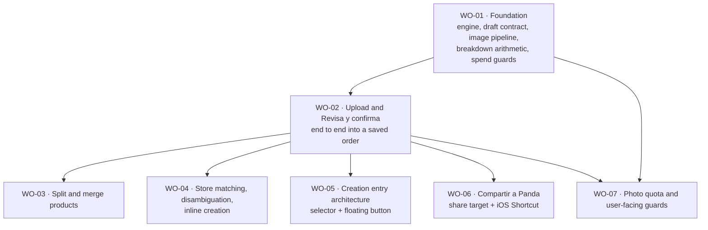

# BP-01 Order Image Intake System

## Purpose

Define how "Crear desde imagen" is built: the client image pipeline, the AI extraction adapter and its draft contract, the deterministic breakdown and price-split engine, the review-and-confirm surface, the two entry doors (in-app selector and OS share target), and the consumption and spend guards that keep a shared API key from becoming an unbounded liability.

One blueprint covers the whole FRD. The feature is a single pipeline with two doors; cutting it into "engine" and "UI" blueprints would be a technical-layer split, which is forbidden, and cutting it by door would duplicate the contract that both doors depend on.

## Runtime Components

### Client

| Component                 | Location (proposed)                                                             | Responsibility                                                                                                                                                                                                                                                                                                    |
| ------------------------- | ------------------------------------------------------------------------------- | ----------------------------------------------------------------------------------------------------------------------------------------------------------------------------------------------------------------------------------------------------------------------------------------------------------------- |
| Image compression helper  | `src/lib/images/compressForIntake.ts`                                           | WebP `q0.85` with real encoder detection, JPEG `q0.90` fallback, cap `1080x2400`, never upscale, never downscale below native width, split long screenshots with 10% overlap, always return the re-encoded output (never the original file), flagging `recompressedLarger` when recompression does not shrink it. |
| Encoder support detection | `src/lib/images/canvasEncoding.ts`                                              | `canvas.toDataURL("image/webp")` prefix check plus a blob `type` check. Also fixes the existing silent Safari PNG bug in `getProcessedImageBlob.ts`.                                                                                                                                                              |
| Intake client flow        | `src/app/[locale]/(app)/orders/new/image/_components/`                          | Upload surface, passive counter, overflow interruption, processing states, review screen, inline store resolution, split and merge modal (the modal's only entry point, **ADR 0023**).                                                                                                                                                                         |
| Creation selector         | `src/app/[locale]/(app)/orders/_components/share/OrderCreateMethodSelector.tsx` | The single "Nuevo pedido" selector, rendered inline (empty state) or as `Modal` / `Sheet` (populated surface).                                                                                                                                                                                                    |
| Floating action button    | `src/components/modules/` (new, see FDD)                                        | Single-action button, breakpoint and route gated.                                                                                                                                                                                                                                                                 |

### Server

| Component                  | Location (proposed)                                                    | Responsibility                                                                                                                                                                                                            |
| -------------------------- | ---------------------------------------------------------------------- | ------------------------------------------------------------------------------------------------------------------------------------------------------------------------------------------------------------------------- |
| Intake Server Action       | `src/app/[locale]/(app)/orders/_actions/imageIntakeActions.ts`         | Authenticated entry for the in-app path: validate, reserve quota, call the engine, return the draft.                                                                                                                      |
| Share-target route handler | `src/app/api/orders/image-intake/share/route.ts`                       | `POST multipart/form-data` entry for the Android share target and the iOS Shortcut. Follows the precedent of `src/app/api/notifications/dispatch/route.ts`.                                                               |
| Upload validation          | `src/lib/imageIntake/validateUpload.ts`                                | Server-side `sharp.metadata()` validation. Validates and measures only, never re-encodes.                                                                                                                                 |
| Extraction adapter         | `src/lib/imageIntake/extractionEngine.ts`                              | Provider-agnostic interface with a single Gemini implementation.                                                                                                                                                          |
| Prompt and glossary        | `src/lib/imageIntake/prompt.ts`                                        | System prompt, Peruvian collector glossary, breakdown-rule instructions, provenance instructions.                                                                                                                         |
| Draft contract             | `src/lib/imageIntake/draftSchema.ts`                                   | Zod schema for the extracted draft, including per-field provenance.                                                                                                                                                       |
| Breakdown engine           | `src/lib/imageIntake/breakdown.ts`                                     | Deterministic post-processing: quantity normalisation, price split, zero-decimal handling, 200-product ceiling.                                                                                                           |
| Quota and spend            | `src/lib/data/imageIntake/imageIntakeMutations.ts` and `spendGuard.ts` | Reservation (`PENDING` row with an estimated cost, under an advisory lock), settlement (`SUCCEEDED`/`FAILED` with real tokens and cost), and the ledger-backed `SpendGuard`. Follows ADR 0015 (`src/lib/data/<domain>/`). |

### Persistence

| Model                      | Shape                                                                                                                                                                                                                                                  | Notes                                                                                                                                                                                                                                                                                                                                                                          |
| -------------------------- | ------------------------------------------------------------------------------------------------------------------------------------------------------------------------------------------------------------------------------------------------------ | ------------------------------------------------------------------------------------------------------------------------------------------------------------------------------------------------------------------------------------------------------------------------------------------------------------------------------------------------------------------------------ |
| `ImageIntakeUsage`         | Reservation-then-settlement ledger: `userId`, `periodKey` (`YYYY-MM`), `dayKey`, `entrySource`, `imageCount`, `status` (`PENDING` \| `SUCCEEDED` \| `FAILED`), `model`, `inputTokens`, `outputTokens`, `costMicroUsd` (integer), `orderId` (nullable). | Each row is created `PENDING` with an estimated cost before the provider call and receives exactly one settlement update to `SUCCEEDED` or `FAILED` with the real figures; it is no longer strictly append-only. `imageCount` is the field that counts against the bag. Cost stored in micro-dollars as an integer, matching the repository's minor-unit convention for money. |
| `ImageIntakePeriod`        | Aggregate, unique on (`userId`, `periodKey`): `usedPhotos`, `costMicroUsd`.                                                                                                                                                                            | Makes the quota check one indexed read instead of a scan.                                                                                                                                                                                                                                                                                                                      |
| `User.aiMonthlyPhotoLimit` | Optional integer.                                                                                                                                                                                                                                      | Per-user override set by an administrator.                                                                                                                                                                                                                                                                                                                                     |

No scheduled job exists for the reset: it is implicit in the period key. `userId` is duplicated onto the ledger rows per `data-layer-user-id-duplication.mdc`.

## Architecture Decisions

1. **The extraction adapter is provider-agnostic behind one interface, with exactly one implementation.** The interface exists so the plan-B provider (Claude Haiku 4.5) and the free challenger (Qwen3-VL-Flash) can be swapped or A/B compared without touching callers. It does **not** exist to support runtime multi-provider routing: `FR-11-20` forbids automatic escalation. See ADR 0020.
2. **Provenance is part of the contract, not a UI concern.** Every scalar in the draft schema is a `{ value, source: "read" | "assumed" | null }` shaped field. The review screen renders focusability from `source`, and the currency rule (`FR-11-32`) is a direct consequence. If provenance were computed in the UI, the "assumed" marker would drift from reality.
3. **The model decides the breakdown, the server decides the arithmetic.** The model returns groups with named units and a doubt flag. All price distribution, the zero-decimal handling, the quantity-1 normalisation, and the 200-product ceiling are deterministic server code with unit tests. No number the user sees as money is produced by the model beyond what it literally read. The unit conversion belongs to the same principle (`BR-11-23`): the model reports the amount as written and the server scales it, because a model asked to multiply produces a valid-looking integer that nothing downstream can audit.
4. **The draft is an input to the existing order domain, not a parallel write path.** Saving calls `createOrder`, `addOrderPayment`, and `createDelivery` through `orderCreateSchema` and `orderPaymentCreateSchema`. There is no intake-specific persistence of orders.
5. **Quota is reserved before the provider call, inside a transaction.** Reserving afterwards lets two concurrent requests jump the bag. The reservation is whole-submission (`FR-11-77`), and a provider failure releases it (`FR-11-76`).
6. **The global spend cut-off is foundation, not a late slice.** It ships with the engine even though the user-facing bag ships last, because there is exactly one shared API key and a retry loop over five images can outspend a whole month in seconds. The user-facing quota is a product decision; the global cut-off is a liability control.
7. **Both doors converge before the review screen.** The share-target route handler and the in-app Server Action produce the same draft object through the same code path. The only difference is where the bytes came from and how authentication is resolved.
8. **The share target hands the file back to the client pipeline.** Android posts the original, uncompressed file to the share-target URL, so no client compression has happened yet and a multi-megabyte screenshot can breach the 4.5 MB request ceiling. Proposed contract: the service worker intercepts the `POST`, stashes the file (Cache Storage or IndexedDB) under a short-lived key, redirects to the intake landing page, and the page reads the stash and runs the normal compress-and-upload path. This keeps one pipeline and one set of guards. It is recorded as `OQ-11-05` and must be confirmed against the shipped service worker (owned by **FRD-09** · [`frd-09-reminders-and-notifications.md`](../../frd-09-reminders-and-notifications/frd-09-reminders-and-notifications.md)) before WO-06 is enriched.
9. **The expired-session resume reuses that same stash.** If the session is gone, the stash key survives the sign-in redirect and the landing page resumes from it (`FR-11-66`).
10. **The selector is one component with two presentations.** Inline cards and modal/sheet are the same component with a `presentation` prop, so the copy, the analytics, and the disabled-when-exhausted behaviour cannot diverge.
11. **Split and merge is one modal on one surface, and it persists nothing.** Since **ADR 0023** its only entry point is the review screen's group chip, so confirming it is a local transform of the in-memory draft. There is no server action, no mutation, and no live-delivery guard: a draft has no deliveries. Manual create and edit deliberately offer neither control, because in a form the collector writes the rows and adding or removing one already covers it.
12. **`resolveStore` is promoted, not copied.** The script-local function in `scripts/local/migrate-pedidos/chat-load.ts` becomes a shared helper in `src/lib/data/stores/`. See `OQ-11-04`.

## Contracts

### Extracted draft (conceptual shape)

```
ImageIntakeDraft {
  store:      { matchedStoreId | null, name: Field<string>, phone: Field<string> , candidates: StoreCandidate[] }
  currency:   Field<CurrencyCode>            // source distinguishes read vs assumed (FR-11-32)
  orderDate:  Field<ISODate>                 // resolved against the visible message time (FR-11-26)
  totalCost:  Field<MinorUnits>
  groups:     ExtractedGroup[]
  payments:   { amount: Field<MinorUnits>, paidAt: Field<ISODate> }[]
  delivery:   { expectedFrom, expectedTo, cost } | null
  warnings:   IntakeWarning[]                // ceiling exceeded, unreadable region, audio present, etc.
}

ExtractedGroup {
  sourcePhrase: string        // quoted verbatim in the review chip (FR-11-57)
  reason:       "split" | "sealed" | "not-nameable" | "open-range"
  doubtful:     boolean
  products:     ExtractedProduct[]
  priceSplit:   "explicit-unit" | "divided-lot" | "none"
}

ExtractedProduct {
  name:                    string                 // quantity is always 1 (FR-11-37)
  unitPrice:               MinorUnits | null
  suggestedProductTypeKey: CatalogKey | null      // always inferred, so a plain suggestion and not a Field (FR-11-90)
  referenceUrl:            HttpUrl | null         // captured only, never persisted (FR-11-95, FR-11-96)
}

Field<T> = { value: T | null, source: "read" | "assumed" | null }
```

`MinorUnits` above is the draft's own unit, not the model's. The wire contract is deliberately different: the model answers with the amount **as the image shows it, in the currency's major unit** (`59.90`), and the server scales it once into ×100 minor units (`parseImageIntakeModelResponse`, the only function allowed to turn a provider response into a draft) before the breakdown engine, the review screen, or the save path ever sees it. Same for the currency, which travels as an ISO 4217 code and is dropped to "not read" rather than allowed to invalidate the draft when the model answers a symbol. See `FR-11-24a`, `FR-11-31a`, `BR-11-23`, and ADR 0020.

The draft is mapped to `orderCreateSchema` only at save time. It is never persisted as a draft record: there is no draft table in this FRD (the Buzón Panda proposal, which would need one, is out of scope).

### Boundary contracts fixed now

- **Engine boundary**: `extract(images: Buffer[], context: { baseCurrency, now, locale, productCategories }) => ImageIntakeDraft`. Callers never see provider types. `productCategories` is the live active catalog as `{ key, label }` pairs, read per request by the caller (`FR-11-91`); the engine and the prompt never read the catalog themselves, and never hold a copy of it.
- **Category boundary**: a suggested category leaving the server is always one the live catalog backs. The check runs once, server-side, right after extraction (`FR-11-92`), and drops anything else to `null`.
- **Quota boundary**: `reservePhotos(userId, count) => Reservation` inside a transaction; `settleReservation(reservation, outcome)` on success or failure. Callers never write the ledger directly.
- **Save boundary**: the review screen submits the confirmed draft to the existing order-creation path. Nothing in `src/lib/imageIntake/` writes an `Order`.
- **Split/merge boundary**: none. The operation lives entirely in the review screen's client state (`IntakeGroupCard` → `onApply`), so it crosses no server boundary and touches no order mutation (**ADR 0023**).

## Operational Priorities

1. **Data correctness over ergonomics.** A wrong number that the user cannot detect is the only unacceptable failure. Every ambiguity resolves toward "show it and let the user decide".
2. **Cost containment.** One shared key, no per-user keys. The global cut-off, the per-request ceilings, the single pass, the pinned minimum reasoning level, and the rate limit all exist for this.
3. **Privacy.** Paid provider tier only, zero image retention, EXIF stripped by the canvas step. The images contain names, phone numbers, and amounts belonging to third parties who never agreed to anything.
4. **Latency honesty.** Three to eight seconds is normal. The processing screen names what is happening instead of showing an indeterminate spinner.
5. **Observability.** Every submission writes a ledger row, reserved `PENDING` with an estimated cost before the provider call and settled once to `SUCCEEDED` or `FAILED` with the real model, tokens, and cost, including failed submissions, so the 60-day review can compare the assumed distribution against reality.

## Dependencies

- A new AI provider SDK dependency (none is installed today). New environment variables are required and must be added to `.env.example` per `env-example.mdc`: the provider API key, the global monthly alert and cut-off thresholds, and the model identifier.
- `next.config.ts` `experimental.serverActions.bodySizeLimit` must move from `6mb` to `4mb` (`FR-11-84`).
- The PWA manifest and service worker (**FRD-09**) for the share target.
- `User.baseCurrencyCode` and `budgetResetDayOfMonth` (**FRD-07**).
- `requireAdmin` / `getIsAdmin` and the audit log (**PRD-03 · FRD-01**) for the per-user override.
- The store creation path and its `PENDING` default (**FRD-04** · [BP-01](../../frd-04-store-domain/bp-01-store-public-trust-system/bp-01-store-public-trust-system.md)).
- The order and payment mutations (**FRD-05**).

## Risks

| Risk                                                                     | Impact                                                                            | Mitigation                                                                                                                                                                        |
| ------------------------------------------------------------------------ | --------------------------------------------------------------------------------- | --------------------------------------------------------------------------------------------------------------------------------------------------------------------------------- |
| The model invents a number it could not read                             | Silent data corruption, the worst failure mode                                    | Nullable fields, an explicit instruction to return null, provenance in the contract, and the unskippable review screen                                                            |
| Runaway spend from a retry loop                                          | A shared key can outspend a month in seconds                                      | Global cut-off in the foundation slice, single retry on transport errors only, rate limit, per-request ceilings, independent Cloud budget                                         |
| Extraction quality on informal Peruvian Spanish is unknown               | The feature could be unusable in practice                                         | Measured with the owner's real chats during WO-01 and WO-02 before any further investment; Qwen3-VL-Flash validated in parallel at zero cost                                      |
| Share target unavailable on iOS and requires an installed PWA on Android | Half the promised tap reduction may not land                                      | iOS Shortcut as the documented equivalent; PWA install handled by an onboarding step; the limitation is stated to the user rather than hidden                                     |
| Vercel 4.5 MB request ceiling breached by the share path                 | Raw 413, no readable error                                                        | Blueprint decision 8: the share target hands the file back to the client pipeline so compression always runs before upload                                                        |
| Duplicate stores from the same seller written differently                | Pollutes the store layer that FRD-04 protects                                     | `normalizeStoreName`, the promoted `resolveStore`, phone matching, the disambiguator with no preselection, and inline creation that goes through the standard store-creation path |
| A 50-row review screen gets scrolled and accepted, not reviewed          | Defeats the entire point of mandatory review                                      | The group, not the row, is the review unit; collapse at 6 or more; a row-level doubt forces expansion                                                                             |
| Safari silently returning PNG from canvas                                | Larger uploads and a mislabelled file type, already happening in production today | Real encoder detection fixed in the foundation slice                                                                                                                              |

## Extension Points

- **A second entry door** (the Buzón Panda Telegram bot and email inbox) plugs into the same `extract` boundary and the same review screen. It would additionally need a draft queue, which this blueprint deliberately does not build.
- **A different provider** swaps the single implementation behind the engine boundary. ADR 0020 records what would justify that.
- **Pasted text as an input** already costs nothing against the bag (`FR-11-72`); the engine boundary accepts text alongside images without a contract change.
- **Per-user API keys**, if the product ever monetises, would replace the global cut-off with per-tenant accounting. The ledger's shape (per user, per period, real cost) already supports it.

## Implementation Plan



Plain-text sequencing:

1. **WO-01 is the foundation and must land first.** It is the only non-vertical slice. It ships no UI and no route, and it is validated with unit tests only. It is justified because WO-02, WO-06, and WO-07 all consume the same engine, the same draft contract, the same image pipeline, and the same spend ledger.
2. **WO-02 is the spine.** It turns the foundation into a user-visible outcome: attach photos, extract, review, save an order. Everything after it is either an enrichment of the review screen or another way into it.
3. **WO-03, WO-04, WO-05, and WO-06 can run in parallel once WO-02 is complete.** They touch different surfaces: the split/merge modal on the review screen, the store resolution block, the entry architecture, and the OS share target.
4. **WO-07 closes the feature** with the user-facing bag, the passive counter, the overflow interruption, the exhausted state, and the admin override. It depends on WO-01 (the ledger) and WO-02 (the upload surface that hosts the counter).

Two ordering notes that are not negotiable:

- **The global spend cut-off does not wait for WO-07.** It is inside WO-01. Shipping WO-02 to any real user without it would expose a shared API key with no ceiling.
- **WO-03 is a product-completeness gate for the feature, not for WO-02.** WO-02 is independently demoable and testable, but the breakdown rule only dares to split on doubt because merging costs one tap on the review screen (`BR-11-06`). The feature must not be announced to users before WO-03 lands. Since **ADR 0023** that one tap is only available before saving, which makes the review screen, not a later correction, the moment the rule relies on.

Deferred to `enrich-work-order-context`, with expected depth:

| Work order | Needs enrich                                                             |
| ---------- | ------------------------------------------------------------------------ |
| WO-01      | high (prompt engineering, provider client details, ledger schema review) |
| WO-02      | high (review-screen interaction detail, error taxonomy)                  |
| WO-03      | medium                                                                   |
| WO-04      | high (`OQ-11-03` must be resolved first)                                 |
| WO-05      | medium                                                                   |
| WO-06      | high (`OQ-11-05` must be resolved first)                                 |
| WO-07      | medium                                                                   |

## Linked Work Orders

In implementation order. WO-03 through WO-06 are parallelizable after WO-02.

1. [`wo-01-extraction-engine-and-intake-foundation`](work-orders/wo-01-extraction-engine-and-intake-foundation.md) (foundation, no UI)
2. [`wo-02-image-upload-and-review-confirm`](work-orders/wo-02-image-upload-and-review-confirm.md)
3. [`wo-03-product-split-and-merge`](work-orders/wo-03-product-split-and-merge.md)
4. [`wo-04-store-matching-and-inline-creation`](work-orders/wo-04-store-matching-and-inline-creation.md)
5. [`wo-05-order-creation-entry-architecture`](work-orders/wo-05-order-creation-entry-architecture.md)
6. [`wo-06-share-to-panda-share-target`](work-orders/wo-06-share-to-panda-share-target.md)
7. [`wo-07-photo-quota-and-spend-communication`](work-orders/wo-07-photo-quota-and-spend-communication.md)
