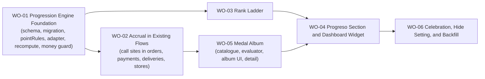

# BP-01 Collector Progression

## Purpose

Define the technical shape of the progression layer specified in [`FRD-12`](../frd-12-collector-progression.md): an append-only points ledger with a derived balance, a permanent ten-rank ladder, a 24-medal album, and the four surfaces that expose them (the `Progreso` section, the medal detail subview, the dashboard widget, and the global unlock/celebration feedback). One blueprint covers the full vertical, from the Prisma schema through the last collector-facing screen, because the engine and its surfaces share one data contract and splitting them would force every slice to re-agree on it.

## Runtime Components

- four new Prisma models: `PointLedgerEntry` (append-only, carries `voidedAt`/`voidedReason`/`voidedByUserId` for the admin void), `UserProgress` (rebuildable cache), `MedalUnlock`, `ProgressionSettings`
- a dependency-light rule module, `src/lib/data/progression/pointRules.ts`, that never imports anything touching money
- a money-predicate adapter, `src/lib/data/progression/moneyPredicateAdapter.ts`, the only module in the domain allowed to read a monetary field
- a rank ladder module, `src/lib/data/progression/rankLadder.ts`, and a medal catalogue module, `src/lib/data/progression/medalCatalogue.ts`
- an on-demand recompute engine, `src/lib/data/progression/recompute.ts`
- query and mutation modules, `src/lib/data/progression/progressionQueries.ts` and `progressionMutations.ts`
- a static money guard test, `src/test/progression-money-guard.test.ts`, extending the pattern already proven by `src/test/money-modules-guard.test.ts`
- credit call sites added to the existing mutation modules for orders, payments, deliveries, and stores (named per file below)
- routes under `src/app/[locale]/(app)/progress` (section with three tabs, medal detail subview)
- a dashboard widget under `src/app/[locale]/(app)/dashboard/_components/`
- a settings section (hide toggle, purge action) under `src/app/[locale]/(app)/settings/`
- global toast and rank-celebration surfaces, reusable from any host flow
- a one-off backfill script for the migrated Notion history
- an admin void mutation and read-only ledger query reusing `writeAuditEntry` from `src/lib/data/admin/adminAuditMutations.ts`
- new i18n namespace `src/i18n/locales/{es,en}/progress.json`
- new `POSTHOG_EVENTS.PROGRESSION` group in `src/lib/constants.ts`

## Architecture Decisions

- **The engine is one coherent vertical, cut as a foundation slice followed by user-facing vertical slices**, the same shape [`FRD-08 · BP-01`](../../frd-08-delivery-management/bp-01-delivery-management/bp-01-delivery-management.md) used. There is no separate "backend blueprint" and "frontend blueprint".
- **Points are an append-only ledger with a derived balance, never a mutable counter** (`FR-12-01` through `FR-12-03`, `BR-12-05`). This is settled architecture: [ADR 0035](../../../../design/decisions/0035-collector-progression-point-ledger.md) is already accepted and is the canonical shape `WO-01` implements verbatim, including the `(userId, ruleKey, entityId)` unique constraint and the plain-string `entityId` with no foreign key (`BR-12-18`).
- **No point rule reads money, ever.** [ADR 0035 §4](../../../../design/decisions/0035-collector-progression-point-ledger.md) already commits to a static guard mirroring `src/test/money-modules-guard.test.ts`, run in the opposite direction: money modules must not read the coverage mark, and here `pointRules.ts` must not read money. `WO-01` builds this guard with the same requirement the existing one carries: the fixture must contain a forbidden token the scanner actually flags (`AC-12-06`), never an empty file that trivially passes.
- **Medal rarity is a five-grade print-run system with a frozen visual treatment per grade, and color is never the sole signal.** [ADR 0036](../../../../design/decisions/0036-medal-rarity-visual-system.md) is already accepted and governs `WO-05`; this blueprint does not redefine the visual system, only the data and evaluator behind it. The visual specification itself belongs to the FDD and its prototype, owned by other agents.
- **Six ADRs total are expected by the FRD's Implementation Notes; four remain to be written during implementation**, one per the work order that first needs the decision it records, rather than all six up front before any code proves the shape correct:
  - `WO-02` writes [`ADR 0037`](../../../../design/decisions/0037-progression-deferred-credit-no-pending-state.md), deferred credit with no pending UI state (`FR-12-05`): `order-created` posts immediately, the remaining 20 points for `order-registered` are a plain-copy promise, never a provisional ledger row. It also carries the one-writer-per-rule decision above and the two transaction corollaries.
  - `WO-03` writes `ADR 0038`, the permanent rank and the merit lock (`FR-12-16`, `FR-12-17`, `BR-12-06`).
  - `WO-04` writes `ADR 0039`, the phased social surface (`FR-12-39`, `BR-12-21`): the disabled placeholder, and the hard legal preconditions a future comparison FRD must clear.
  - `WO-05` writes `ADR 0040`, medals granting no points and never being revoked (`FR-12-22`, `FR-12-23`, `BR-12-08`), distinct from `ADR 0036`'s visual-system decision.
    Numbers are assigned in the fixed order above, continuing from `0036`, regardless of the order the work orders actually ship in.
- **The recompute is on-demand, not a cron job or a materialized view** (`FR-12-11`), per [ADR 0035 §3](../../../../design/decisions/0035-collector-progression-point-ledger.md). It runs when the collector opens `Progreso` and the cache is older than six hours, and after any administrative void.
- **The ledger write sits inside the host mutation's own transaction, after its last refusal** (`FR-12-12`, ADR 0022 applied to a new writer). The progress cache is never written inside a money transaction: it is a separate, best-effort write outside the host transaction, because folding a per-user cache row into the Serializable payment path would introduce a new write-write conflict surface `FRD-05` does not currently have. Two corollaries `WO-02` had to establish in code and recorded in `ADR 0037`: a credit inside a host transaction resolves its duplicate with `ON CONFLICT DO NOTHING` (`createMany({ skipDuplicates: true })`) and NEVER by catching the unique violation, because PostgreSQL aborts the whole transaction on a constraint error and the catch-and-continue form would roll back a real order on a retry; and the `pointsDelta` a Server Action returns is the difference between the cached total and the freshly recomputed one, never the sum of the rows just appended, so a truncating cap or an unmet condition (`BR-12-13`) reports honestly rather than optimistically.
- **Credit failures are swallowed by the host action** (Error Contract, FRD-12). A failed ledger append never turns a successful order, payment, store, or delivery mutation into a refusal; it is captured once with progression-safe context and the next recompute or retry (protected by the idempotency key) picks the fact up from real state.
- **Settlement is two transactions, not three.** Progression rides on top of [`FRD-08 · BP-01`](../../frd-08-delivery-management/bp-01-delivery-management/bp-01-delivery-management.md)'s existing two-transaction settlement split (`ADR 0032`); the ledger write happens inside whichever of those two transactions is the host mutation's own (the delivery transaction for `delivery-received`, never the independent money transaction, since the money transaction's own writer, `createStorePayment`, is where `order-first-payment` and `order-payment-detailed` credit).
- **Medals grant no points and unlock is evaluated by the same call sites that credit points**, not by a separate pass. `WO-02` wires point crediting into every anchor mutation first and ships the Server Action contract shape (`pointsDelta`, `rankUp`, `medalsUnlocked: []`, populated with an empty array until `WO-05` exists); `WO-05` fills the same call sites with the real medal evaluator. This mirrors the incremental-delivery shape already used by `FRD-08 · BP-01`'s `WO-08`, which extended call sites `WO-02` and `WO-04` had already shipped rather than opening a parallel lifecycle path.
- **`der.` rules have their ELIGIBILITY evaluated by the recompute, but their entry is still appended by one call site each** ([ADR 0037](../../../../design/decisions/0037-progression-deferred-credit-no-pending-state.md), written by `WO-02`). The original wording here ("no mutation writes a ledger row for them directly") was wrong in a way only the built engine could show: the recompute iterates the LEDGER, not the world, so `order-completed`, `order-settled` and `product-type-discovered` had no writer at all and were worth zero forever with every unit test green. Each now has exactly one writer, placed where the state it depends on is derived and persisted (`persistDerivedOrderStatuses` for completion, the two `PaymentAllocation` producers for settlement, the delivery mutation that moves a product to `DELIVERED` for discovery). The division of labour is unchanged and is the point: the write only PRICES the fact at the instant it happens, the recompute alone decides whether it still COUNTS. Phase 2's `order-data-complete` and `store-created-adopted` inherit the same shape when they ship.
- **Admin void and the read-only ledger view are data-layer only in this blueprint.** A void never deletes or negates a `PointLedgerEntry`; it sets that row's `voidedAt`, `voidedReason`, and `voidedByUserId`, and the recompute excludes any row with `voidedAt != null` from the next balance calculation. `WO-01` ships `voidUserProgressionPoints` (writes `admin_audit_log` in the same transaction via `writeAuditEntry`, `FR-12-44`) and `listUserPointLedger` (`FR-12-45`) as callable mutation/query functions with no dedicated route. This mirrored the FRD's own note that `admin_audit_log` was excluded from the production cutover, so the write path existed in code before it could safely run in production. **That deferral is now closed**: `admin_audit_log` is in the schema (migration `20260723200006`) and the deploy pipeline runs `prisma migrate deploy`, so [`WO-07`](work-orders/wo-07-admin-progression-surface.md) wires both functions into the existing `src/app/[locale]/(app)/admin` surface as a `Progresión` section. `WO-07` consumes them unchanged and adds no data-layer writer of its own: the void's scope stays "every live entry for one collector", because narrowing it to a selection or a date range is a mutation change no requirement asks for.
- **The backfill script is a one-off, not a recurring job**, invoked by an operator against the migrated Notion history (`FR-12-42`, `FR-12-43`). It calls the same `pointRules.ts` catalogue and the same idempotent ledger-write helper `WO-01` ships, so a re-run is a no-op rather than a duplicate-entry risk.

## Contracts

- **ledger write contract**
  - input: `userId`, `ruleKey`, `entityType`, `entityId` (string, no FK), `points` (positive integer), `occurredOn` (civil day, server-resolved), `source` (`LIVE` | `BACKFILL`)
  - behavior: idempotent upsert-or-skip on `(userId, ruleKey, entityId)`; never edits, never deletes, never writes a negative value
  - output: `{ credited: boolean }` (`false` when the unique constraint already held the row)
- **recompute contract**
  - input: `userId`
  - behavior: reads all of the user's ledger entries, resolves per-`entityType` eligibility in batch against current state, applies the monthly/lifetime caps of `FR-12-06`, derives the current rank index (honoring the merit lock for ranks 9-10), compares against the stored highest rank index and raises it if exceeded, evaluates medal conditions, writes the result to `UserProgress` and any newly-`unlocked` rows to `MedalUnlock`
  - output: `{ derivedTotal, currentRankIndex, highestRankIndex, unlockedThisRun: MedalKey[] }`
  - guarantee: idempotent, running it twice with no intervening mutation yields identical output (`AC-12-14`)
- **credited-mutation Server Action contract**
  - every Server Action that wraps a crediting mutation returns its normal payload plus a `progression` field: `{ pointsDelta: number; rankUp: { from: number; to: number } | null; medalsUnlocked: MedalUnlockSummary[] }`
  - `MedalUnlockSummary`: `{ medalKey, rarity, series }`, enough for the optimistic toast and nothing that leaks another user's data. Amended in `WO-05`: the display `name` was dropped, because this payload is produced inside a mutation that has no locale, so a name resolved there would be a hardcoded user-facing string. The client already holds the catalogue key and reads `progress.medals.<medalKey>.name` from its own translations.
  - a failed credit (caught and swallowed per the Error Contract) returns `progression: null`, never a partial or guessed delta
- **`Progreso` section data contract**
  - `getProgressSummary(userId)` → current/highest rank index and key, `"Rango N de 10"`, derived total, next threshold, points missing, merit-lock counts (rank 6+), this month's breakdown by rule group, cache age
  - `getMedalAlbum(userId)` → catalogue joined with unlocks, grouped by series, per-series and global counters, silhouette/secret rendering flags
  - `getMedalDetail(medalKey, userId)` → name, series, rarity, condition text, hint, `publicSafe`, unlock date, ordinal when numbered, `stateful` currency, event window
  - the static ten-rank ladder (no query, a constant)
- **settings contract**: `toggleProgressionVisibilityAction`, `purgeProgressionLedgerAction` (confirmed, awaited, deletes ledger + unlocks + cache for the user)
- **error contract** (verbatim from the FRD, restated here as the implementation surface): `PROGRESS_RECOMPUTE_BUSY`, `PROGRESS_CACHE_MISSING`, `PROGRESSION_ALREADY_HIDDEN`, `PROGRESSION_PURGE_NOT_CONFIRMED`, `USER_NOT_FOUND`, `VOID_REASON_REQUIRED`, `AUDIT_WRITE_FAILED` (rolls the void back), `BACKFILL_ALREADY_APPLIED`, `BACKFILL_SOURCE_INCOMPLETE`

## Operational Priorities

- correctness of the derived balance over raw write throughput: the recompute must be right before it is fast
- no rule may ever read a monetary field, enforced by a build-time guard rather than review discipline
- progression is a secondary effect that must never fail a business mutation
- the rank is permanent and private; nothing in this blueprint builds a path to compare users
- silence on backfill: the migrated history must not fire dozens of toasts on first login after the migration

## Dependencies

- `Order`, `OrderItem`, `PaymentAllocation`, `Store` models and their existing mutation modules from [`FRD-05 · BP-01`](../../frd-05-order-payment-shipment/bp-01-order-domain-foundation/bp-01-order-domain-foundation.md)
- `Delivery` model, lifecycle mutations, and `deriveOrderStatus` wrapper from [`FRD-08 · BP-01`](../../frd-08-delivery-management/bp-01-delivery-management/bp-01-delivery-management.md), including the two-transaction settlement split (`ADR 0032`) this blueprint's ledger write must respect
- assisted order intake from [`FRD-11`](../../frd-11-order-image-intake/frd-11-order-image-intake.md), the anchor for `order-created-from-image`
- the seeded product-type catalog from [`FRD-07`](../../frd-07-user-settings/frd-07-user-settings.md), the denominator for `product-type-discovered`
- the settings surface's `Preferences` section from [`FRD-07`](../../frd-07-user-settings/frd-07-user-settings.md), where the hide toggle lives
- the dashboard's read-only contract from [`FRD-06`](../../frd-06-dashboard/frd-06-dashboard.md)
- the audit writer `writeAuditEntry` from [`PRD-03 · FRD-01`](../../../prd-03-admin-and-moderation/frd-01-admin-identity-and-access/frd-01-admin-identity-and-access.md) — a **hard ordering dependency** for the admin void path: `admin_audit_log` was excluded from the production cutover ([`project_prod_cutover_2026-08-22`]), so the void mutation ships in code but cannot run in production until that table exists there
- store review model and `upsertStoreReview` from [`FRD-04`](../../frd-04-store-domain/frd-04-store-domain.md), the anchor for `store-reviewed`
- the civil-day timezone resolver already used by the budget cycle ([`FRD-08 · BR-08-13`](../../frd-08-delivery-management/frd-08-delivery-management.md#business-rules)), reused for `occurredOn` (`FR-12-10`)

## Risks

- **recompute cost grows with ledger size.** Correct up to roughly twenty thousand entries per user per the FRD's own note; no user is near that today, so the ceiling is re-measured when it becomes real rather than pre-optimized now.
- **the Notion backfill is a one-shot, hard-to-rehearse write** against real production history once cutover happens; `WO-06` must run it against a full dev-data copy first, and it must be provably idempotent (`BACKFILL_ALREADY_APPLIED`) before it ever runs against prod.
- ~~**`admin_audit_log` is not yet in production**, so `FR-12-44`'s void mutation is code without a safe place to run until that table lands there.~~ **Closed.** The table ships through migration `20260723200006` and the deploy pipeline runs `prisma migrate deploy`; [`WO-07`](work-orders/wo-07-admin-progression-surface.md) adds the admin route that calls the mutation.
- **caps declared in the wrong unit silently break the sublinear/irrevocability guarantees** (`BR-12-15`); `WO-01`'s cap enforcement must read the unit off the rule definition rather than assuming points everywhere, since `order-created` is the one rule capped in events, not points.
- **a rule accidentally reads a monetary field through a re-export or a shared type** rather than a direct import; the static guard scans source text for forbidden identifiers, so a renamed re-export could slip past a naive implementation. `WO-01`'s guard test must be written against the identifier list, not the import graph, mirroring `money-modules-guard.test.ts`'s own documented blind spots.
- **medal evaluation added at the wrong call site** could double-unlock or miss a "first time" medal if the same business fact is reachable from two different mutations (for example, an order reaching `DELIVERED` through `createDelivery` with `receivedDate` set versus through `markDeliveryDelivered`); `WO-05`'s evaluator must be keyed off the same `entityType`/`entityId` shape the ledger already uses so idempotency is inherited rather than re-implemented per medal.
- **the merit lock's denominator (shipped medals only) can move underneath a collector** as phase 2 ships twelve more medals; `WO-03`'s rank-9/10 gate must recompute the percentage against the catalogue's current shipped count at read time, never cache a fixed denominator.

## Extension Points

- phase 2's twelve remaining medals and eight remaining point rules slot into the same `pointRules.ts` and `medalCatalogue.ts` tables without a schema change
- phase 2's `I` / `II` / `III` grades subdivide a rank band without moving any threshold
- phase 3's time-limited events reuse `MedalUnlock`'s `series`, `availableFrom`, `availableTo`, and `numbered` columns, shipped from `WO-01`; only the administration UI that authors an event is future work
- a future shareable progress card (an exportable image naming only the current user's own rank and medal count) can read `getProgressSummary` without a new query
- a future comparison FRD, once its legal preconditions clear, replaces the disabled placeholder `WO-04` ships without touching the ledger or recompute contracts

## Implementation Plan

- `WO-01` is the foundation slice: Prisma schema, migration, `pointRules.ts`, the money-predicate adapter, the recompute engine, and the static money guard. No UI, no collector-facing routes. It also ships the admin void mutation and read-only ledger query as data-layer functions (`FR-12-44`, `FR-12-45`), since they need no route of their own to satisfy this blueprint's slices. It is validated with unit tests covering the idempotency, deletion, cancellation/reactivation, and reopen scenarios of `AC-12-01` through `AC-12-09`, `AC-12-14`, `AC-12-15`, and `AC-12-16`.
- `WO-02` must happen immediately after `WO-01` because every downstream slice needs real ledger entries to render against. It wires `awardPoints` into the anchor mutations and ships the Server Action contract shape with `medalsUnlocked` returning an empty array until `WO-05` lands.
- After `WO-02`, `WO-05` (medal catalogue and evaluator) can start; it depends on `WO-02`'s call sites already existing because it extends them rather than opening a second set of hooks. `WO-03` (rank ladder) depends only on `WO-01`'s recompute and can be implemented in parallel with `WO-02`/`WO-05`.
- `WO-04` (the `Progreso` section, its three tabs, and the dashboard widget) depends on both `WO-03` (ladder data for the "Rangos" tab and the rank hero) and `WO-05` (album data for the "Medallas" tab), so it is the first slice that needs the whole engine wired end to end.
- `WO-06` (toast, celebration modal, hide setting, purge, and the Notion backfill) depends on `WO-04` because the toast and celebration are global surfaces layered over the same host flows `WO-02`/`WO-05` already credit, and the backfill needs both the point rule catalogue (`WO-02`) and the medal catalogue (`WO-05`) fully wired before it can silently replay history through them.
- `WO-07` (the admin `Progresión` section: read-only ledger view and the point void) depends only on `WO-01`'s two data-layer functions and on `WO-03`'s rank ladder for the summary's rank name, so it could have shipped at any point after those; it runs last because the deferral it closes was an infrastructure one (`admin_audit_log` reaching production), not a code dependency.
- Work-order numbers follow the description order given for this slice cut; they are identifiers, not the execution order. The execution order is the one stated above and in the diagram.

## Linked Work Orders

- `work-orders/wo-01-progression-engine-foundation.md`
- `work-orders/wo-02-accrual-in-existing-flows.md`
- `work-orders/wo-03-rank-ladder.md`
- `work-orders/wo-04-progreso-section-and-dashboard-widget.md`
- `work-orders/wo-05-medal-album.md`
- `work-orders/wo-06-celebration-hide-setting-and-backfill.md`
- `work-orders/wo-07-admin-progression-surface.md`
